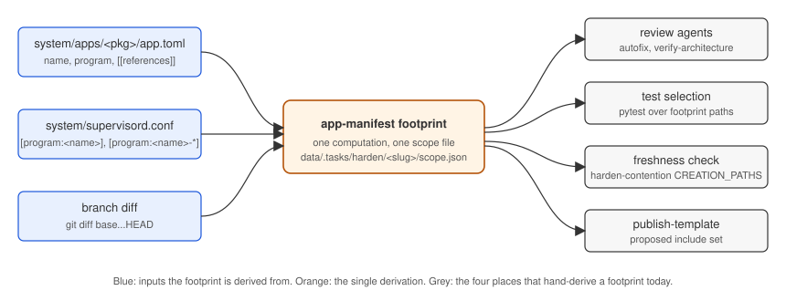

# Plan: app manifest scoping for review and hardening

The design as approved. The "Changes" section is the work list it was implemented from; what shipped, what was measured, and what is still open is in `report-app-manifest-scoping.md` beside this file (the toy fixture named under "Measuring it in a toy setting" lives in a separate worktree and is not merged). This effort stands alone: the code-guardian plugin is out of scope and is not modified.

## Summary

- An app's `app.toml` gains a `[[references]]` list naming the artifacts outside its directory that belong to it (skills that drive it, scripts, docs), plus a `[scope]` table of exclusion globs. The runtime registration ignores both; the manifest library validates them.
- One new computation, `app-manifest footprint`, turns a manifest plus `system/supervisord.conf` into an explicit scope file. Four places that hand-derive an app's footprint today (the review gates, test selection, the merge freshness check, publish-template's include set) read that file instead.
- Review passes read the scope file and confine themselves to it: the diff, the app directory, the referenced artifacts, and a short fixed list of convention docs. Reading outside the scope stays allowed, and every expansion is logged, which is what makes the narrowing measurable.
- The two code-guardian gates (`/autofix`, `/verify-architecture`) stay parked in the harden pass (commit `4d78f0394`; their invocations sit unreferenced in `.agents/shared/worker/references/verification.md`). This design updates `verification.md` so the scope reaches them through `$ARGUMENTS` whenever they are run, and drives tests, the freshness check, and publishing regardless.

## Where scope is decided today

| Seam | What bounds the reading | Kind of bound |
|---|---|---|
| `git diff base...HEAD` (every code-guardian skill and agent) | the changed hunks | hard |
| Problem description written by the invoking agent (`/autofix` Phase 1, `/verify-architecture` Phase 1) | what the agent chooses to say | prose |
| `{creation_context}` paragraph (`verification.md`, from commit `652c82abf`) | "judge against `type-<TYPE>.md` and `system/apps/README.md`, not `system_interface`" | prose, currently unloaded |
| `autofix.append_to_prompt` / `verify_architecture.append_to_prompt` in `.reviewer/settings.json` | extra instructions folded in by the stop hook only | config, unused by direct invocation |
| `.reviewer/code-issue-categories.md` | what to look for | none on where |
| `stop_hook.additional_git_directories` | which repos | directory-granular only |
| `type-app.md` | "`system/apps/<package>/`, its supervisord block, a co-owned `<app>-<role>` service" | prose footprint |
| `harden-contention.md` freshness check | `CREATION_PATHS = system/apps/<package>/ system/supervisord.conf` | hardcoded footprint |
| `publish-template` §1 | the lead reasons out the include paths by hand | hand-derived footprint |
| `type-app.md` test step | `cd system/apps/<package> && uv run pytest` | app directory only |

Two consequences follow.

1. The review agents have no bound on background reading. `analyze-architecture` Step 1 says to read CLAUDE.md, style guide, AGENTS.md, design docs, and "the parts of the codebase relevant to the stated problem"; `verify-and-fix` Step 1 says "understand the existing codebase patterns around the changed files". The worker's worktree is the full repo: 7,273 tracked files, of which 5,671 (78%) are `system/vendor/`, 672 are `system/apps/`, 474 are libs/docs/scripts/services, 200 are `.agents/`. A user app is 17-35 files (`files`: 17, `terminal`: 35). The convention docs alone are 2,780 lines (`AGENTS.md` 277, style guide 2,049, `workspace-internals.md` 99, `contracts.md` 355), and the blueprint plans another 3,690.
2. Nothing links an app to the artifacts built for it. A skill that fetches into `data/.apps/<name>/`, a script under `system/scripts/`, a doc under `docs/` are discoverable only by grepping for the app name. So an app change that breaks its skill's invocation is outside the app-scoped test run and outside anything the reviewer is told to check.

The closest existing precedent for a declared footprint is `template.toml`'s `[recipe] include` (a tuple of repo-root-relative paths, `env_converge.template_manifest.Recipe`), computed at publish time and living in the published repo rather than beside the app.

## Design 1: `[[references]]` and `[scope]` in `app.toml`

The manifest stays the one file that describes an app. The runtime registration copies only `_MANIFEST_OWNED_KEYS` (`system/scripts/forward_port.py`), so the new tables never reach the registry and a bad reference can never crash-loop a program at start. The library's `extra = "forbid"` means both fields are added to `AppManifest` (`system/libs/app_manifest/src/app_manifest/manifest.py`) and to `contracts.md` section 2.

```toml
name = "slack-inbox"
display_name = "Slack Inbox"
icon = "icon.svg"

[[references]]
path = ".agents/skills/slack-inbox-refresh"
note = "Fetches new messages into data/.apps/slack-inbox/ on a schedule; calls POST /api/ingest"

[[references]]
path = "system/scripts/run_slack_inbox.sh"

[scope]
exclude = ["system/apps/slack_inbox/frontend/dist/**", ".agents/skills/slack-inbox-refresh/tests/fixtures/**"]
```

### The TOML shape

`[[references]]` is TOML's array of tables: each `[[references]]` header appends one element to the `references` array, and the key/value lines below it belong to that element until the next header. The manifest already uses this form for `[[actions]]` (`system/apps/chat/app.toml`), so it is the established pattern here. A single-key element can also be written as an inline array, `references = [{path = "..."}, {path = "...", note = "..."}]`, which the manifest also already uses for `params`; the parser produces the same value either way.

A `[references]` table with sub-tables (`[references.slack-inbox-refresh]`) is a different shape: a mapping keyed by a name the author invents. It gives each reference a stable key, at the cost of one more thing to name and keep unique. The path is already the identity, so the array form is the recommendation.

### The fields

| Field | Rule |
|---|---|
| `references[].path` | Required. A literal repo-root-relative file or directory; no globs. Must exist (checked by `validate-manifest` and by a repo-wide test, so a deleted skill or a mistyped path fails loudly). Rejected when under the app's own directory (implicit), `system/vendor/`, `data/` (gitignored), or `system/apps/<other app>/` (an app-to-app dependency is a `pyproject.toml` dependency and is derivable). Duplicate entries are rejected. A family of related artifacts is listed one entry each, so every entry can carry its own `note`; a directory entry covers everything beneath it. |
| `references[].note` | Optional one line: why the artifact belongs to the app and which surface it uses. This is what tells a reviewer which contract to check. |
| `scope.exclude` | Optional list of repo-root-relative globs. Two uses: paths that are never considered even when they changed (generated frontend bundles, vendored assets, fixtures), and subdirectories carved out of an allow-listed path. The list is a denylist and is not exhaustive: it combines with the built-in excludes below, and anything absent from the footprint is "not in scope" rather than "excluded". |

Globs appear only in `scope.exclude`, where "match many, deny all" is the wanted semantics; a reference is a declaration of ownership and stays literal, so validation is exact and each entry can explain itself. Exclude matching uses `pathspec` (gitwildmatch, the same semantics as `.gitignore`), a new dependency of `app_manifest`. CI runs Python 3.12 (`.github/workflows/ci.yml`), so the standard library's `PurePath.full_match` (3.13) is not available, and `fnmatch` has no `**` semantics.

Built-in excludes, applied to every footprint and never listed in a manifest: `system/vendor/**`, `data/**`, `**/node_modules/**`, `**/dist/**` (build output), `**/.venv/**`.

The kind of a reference (skill, script, doc, service) is derivable from the path prefix, so there is no `kind` field to drift.

What stays implicit, because it is derivable: the app directory, the `[program:<program>]` block and every `[program:<name>-*]` block in `system/supervisord.conf`, the manifest itself. A program that serves only this app but is not named after it (the browser's `xvfb`) is declared under `[wiring] programs`; the first label of every standalone program is a reserved app name, so the `<name>-*` rule cannot claim an unrelated program. Cron lines for automations live in `/etc/cron.d/` outside the tree; the skill they run is what gets referenced.

Direction: `app.toml` is the single source of truth. A skill does not declare its app. Skill-side flows (heal or update a skill) find the owning app by reverse lookup (`app-manifest references --for-path <path>`, a scan over the handful of manifests in `system/apps/`).

Who writes a reference:

1. The harden worker, in `type-skill.md`: when the skill being crystallized, updated, or healed drives an app, add the reference to that app's manifest as part of the change.
2. The `update-app` / `build-app` leads: when a change lands outside the app directory, register it.
3. The review pass itself: a diff that touches paths outside the footprint is reported as "unregistered footprint" (see the expansion rule below), which nudges the worker to add the reference or explain.

The scaffold does not emit an empty `[[references]]` or `[scope]`; a manifest with neither is the common case.

Pre-manifest apps (a `pyproject.toml` with no `app.toml`) have no references; their footprint is the directory plus program block, which is today's behaviour. `system_interface` keeps its own flow and never uses references.

## Design 2: footprint-driven review scoping



Figure: the manifest and the supervisord config feed one footprint computation; the four consumers that each hand-derive a footprint today read its output.

### The footprint and the scope file

`app-manifest footprint <manifest> [--diff-base <ref>] --out <path>` (a subcommand of the existing `app-manifest` CLI in `system/libs/app_manifest/src/app_manifest/cli.py`) writes a scope file the worker stores beside its task file:

```json
{
  "creation": {"type": "app", "name": "slack-inbox", "package": "slack_inbox"},
  "primary": ["system/apps/slack_inbox/"],
  "wiring": [{"path": "system/supervisord.conf", "sections": ["program:slack-inbox"]}],
  "references": [
    {"path": ".agents/skills/slack-inbox-refresh", "note": "...", "kind": "skill"},
    {"path": "system/scripts/run_slack_inbox.sh", "kind": "script"}
  ],
  "conventions": [
    "system/apps/README.md",
    ".agents/shared/worker/references/type-app.md",
    "docs/system/style_guide.md"
  ],
  "exclude": ["system/vendor/**", "data/**", "system/apps/slack_inbox/frontend/dist/**"],
  "diff": {"base": "<sha>", "files": ["..."], "outside_footprint": ["..."]}
}
```

- `primary`, `wiring`, `references` are the footprint, copied through from the manifest as literal paths.
- `conventions` is a fixed, short list keyed by creation type.
- `exclude` is the union of the built-in excludes and the manifest's `[scope] exclude`. It is a hard denylist: a file matching it is out even when it changed and even when it sits under a footprint path. Everything else outside the footprint is neither listed nor forbidden; the read budget below governs it.
- `diff.outside_footprint` is the diff's files that are neither in the footprint, nor under `context`, nor excluded. Non-empty means either a missing reference or a change that does not belong on this branch.
- For a skill creation the same command runs with `--for-path .agents/skills/<name>` (the path must exist, since a mistyped path would make the freshness check read as "fresh"): the skill is `primary`, and the owning apps' directories are added as `context`, read-only apart from the `[[references]]` entry the skill run adds to their manifests.

The same scope file drives, with no further hand derivation:

| Consumer | Today | With the scope file |
|---|---|---|
| Review gates (when run) | prose paragraph, unbounded reading | read budget and expansion rule below, delivered via `$ARGUMENTS` |
| Tests (`type-app.md`) | `cd system/apps/<package> && uv run pytest` | `uv run pytest <primary> <each reference dir>` plus the ratchets in those directories, so a referenced skill's tests run when the app changes |
| Freshness check (`harden-contention.md`) | hardcoded `CREATION_PATHS` | `git diff --name-only $BASE HEAD -- <primary> <wiring> <references>` |
| `publish-template` §1 | lead reasons out include paths | proposes the footprint as the include set; the user still confirms at the scope gate |

### How the scope reaches the review agents

One channel: `$ARGUMENTS` on `/autofix` and `/verify-architecture`. Both skills already forward caller text into the sub-agent brief ("Include this context in the description you pass to agents"; "pass the analysis agent the creation context verbatim"). `verification.md` is rewritten so its two invocations pass the scope file path, the read budget, and the expansion rule, replacing the `{creation_context}` paragraph. The consumer-contract check (a change to an app's routes, CLI, or stored data shape must be reflected in every referenced artifact that uses that surface, and the reverse) is part of that same instruction text. Nothing in the plugin, `.reviewer/settings.json`, or the issue categories changes.

`verification.md` stays unloaded by `harden-creation.md`: the gates remain parked. Its invocations stay correct for a by-hand run, which is how the toy measurement below exercises them.

Two hazards for whoever revisits that decision:

- A cross-reference in a loaded reference is a routing instruction. `harden-creation.md` is the worker's "every run" entry, so a sentence in it that names `verification.md` makes every worker read the file and run both gates (measured at about 22 minutes and $26 per trial in a nine-trial A/B). `git grep verification.md -- .agents system` must stay empty outside the changelog.
- Live gates race a milestone's provisional merge: the worker declares a milestone, the lead merges it, and the worker's `validate-diff` then runs against a base that already holds the milestone, sees an empty diff, and widens to the whole app (681 s in one trial). Parking hides the race rather than fixing it; a revived gate has to diff from the task's `diff_base`, not the moving base branch.

### The read budget and the expansion rule

Given to every review agent verbatim:

- Read, in this order: the diff; every file under `primary`; the named `wiring` sections; every `references` path, reading a skill's `SKILL.md` and `scripts/` for how it invokes the app; the `conventions` list.
- Never read a path matching `exclude`.
- Do not read other apps or paths outside the footprint unless following a concrete import, call, URL, or file path from inside the footprint, or unless a finding cannot be confirmed without it.
- Every file read outside the footprint and conventions is listed in the report under `Expanded to:`, with the reason.

The expansion rule is the escape hatch, and the `Expanded to:` list is the measurement surface for success measure 2.

## Measuring it in a toy setting

Fixture, checked in under a test-only path:

- `system/apps/toy_notes/`: the scaffold's Flask app with two routes (`GET /api/notes`, `POST /api/notes`) and a JSON store under `DATA_DIR`.
- `.agents/skills/toy-notes-digest/`: a skill whose `run.py` calls `GET /api/notes` and writes a digest; referenced from the app's `app.toml`.
- The change under review: rename `/api/notes` to `/api/entries` in the app only, committed on a branch.

Two arms run the two `verification.md` invocations by hand on that branch (the gates stay parked in the harden pass): unscoped (the pre-rewrite `verification.md` text) and scoped (the scope file plus the read budget). Metrics, per arm, taken from the agent transcript, which records every `Read`, `Grep`, and `Bash` call:

| Metric | Answers |
|---|---|
| Distinct files read, and lines read | success measure 2, the narrowing |
| Share of reads inside `primary + references + conventions` | success measure 2, the narrowing |
| Files listed under `Expanded to:` | whether the escape hatch is used and why |
| Whether the skill's stale `/api/notes` call is flagged (and fixed by autofix) | success measure 1, the app-related artifact is considered |
| Wall time of the pass | the cost that parked the gates |

Expected result: the scoped arm reads on the order of the fixture's 20-30 files plus 3 convention docs, and flags the skill; the unscoped arm reads more and may or may not flag the skill, since nothing points it there.

## Settled

- `[[references]]` and `[scope]` live in `app.toml`; the array-of-tables form matches the existing `[[actions]]`.
- References are literal files or directories; globs are allowed only in `[scope] exclude`.
- Linking is one-directional: apps reference skills.
- `/verify-architecture` and `/autofix` stay parked in the harden pass; `verification.md` is updated for `$ARGUMENTS` delivery only.
- code-guardian is out of scope; no plugin, settings, or category changes.

## Changes

Manifest and library:

- `system/libs/app_manifest/src/app_manifest/manifest.py`: `AppReference` and `ScopeRules` models; `references: tuple[AppReference, ...]` and `scope: ScopeRules` on `AppManifest`; literal-path rules for references and glob rules for excludes as validators; existence check for every reference in `load_manifest`.
- `system/libs/app_manifest/src/app_manifest/cli.py`: `footprint` and `references --for-path` subcommands.
- `system/test_app_manifests.py`: every reference path in every manifest under `system/apps/` exists (user apps included, since the suite runs in the workspace).
- `docs/system/blueprint/workspace-app-model/contracts.md` section 2, `system/apps/README.md`, `system/libs/app_manifest/README.md`: document the tables.

Worker and leads:

- `.agents/shared/worker/references/type-app.md`, `type-skill.md`: generate the scope file at the start of the run; test over the footprint; register a reference when a skill drives an app.
- `.agents/shared/worker/references/verification.md`: rewrite the two invocations around the scope file, the read budget, and the expansion rule; drop the `{creation_context}` paragraph. Remains unloaded.
- `.agents/shared/references/harden-contention.md`: freshness check reads the footprint.
- `.agents/skills/crystallize-creation`, `update-creation`, `heal-creation`: the task file frontmatter carries `scope_file`.
- `.agents/skills/publish-template/SKILL.md` §1: propose the footprint as the include set.

Toy fixture and measurement:

- `system/apps/toy_notes/`, `.agents/skills/toy-notes-digest/`, and a script that runs the two arms by hand and tabulates the metrics from the agent transcript.

## References

- Manifest schema: `docs/system/blueprint/workspace-app-model/contracts.md` section 2; `system/libs/app_manifest/src/app_manifest/manifest.py`; array-of-tables precedent in `system/apps/chat/app.toml`.
- Registration copies only owned keys: `system/scripts/forward_port.py`, `_manifest_owned_values`.
- Gate removal and the orphaned invocations: commits `652c82abf` (creation context), `4d78f0394` (removal); `.agents/shared/worker/references/verification.md`.
- Review agents and their reading instructions (read-only, out of scope): `~/.claude/plugins/marketplaces/imbue-code-guardian/plugins/imbue-code-guardian/agents/{verify-and-fix,analyze-architecture,validate-diff}.md`; skills `autofix/SKILL.md`, `verify-architecture/SKILL.md`.
- Hand-derived footprints: `.agents/shared/worker/references/type-app.md`; `.agents/shared/references/harden-contention.md` (freshness check); `.agents/skills/publish-template/SKILL.md` §1.
- Declared-path precedent: `system/services/env_converge/src/env_converge/template_manifest.py`, `Recipe.include`.
- Exclude-glob matching: `pathspec` (gitwildmatch); CI Python version in `.github/workflows/ci.yml`.
- Worker template and reviewer flags: `.mngr/settings.toml`, `[create_templates.worker]`.
