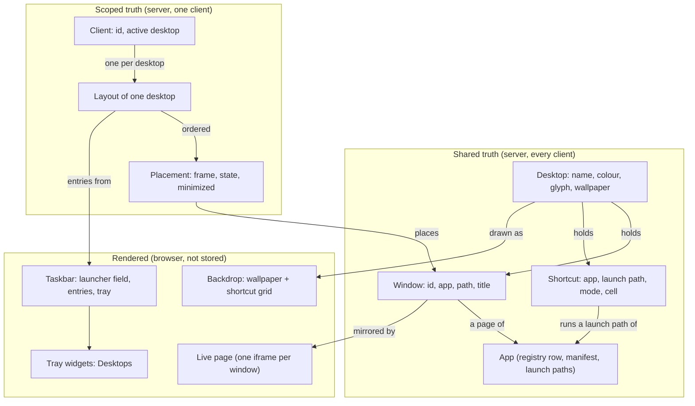

# The desktop interface: concepts and names

Status: agreed (2026-09-19).
Audience: the people and agents who write and implement the V1 spec, [plan-desktop-interface.md](plan-desktop-interface.md), whose exact shapes live in [contracts.md](contracts.md).

This document names every concept of the desktop-style system interface, says what each one is, who owns it, and how it relates to the others.
It supersedes the tabbed-dock vocabulary of the [workspace app model](../workspace-app-model/plan-workspace-app-model.md), and it also retires that model's instance layer: the shell no longer knows what is inside an app.

## 1. What stays

An **app** is a supervised program with a manifest, a registry row, an icon, and its own origin.
A **client** is one browser context with a stored id.
The **registry**, the **inventory** of apps and whether they run, the **browser-side contract** between the shell and the pages it frames, and the **embedder relay** to the minds chrome all stay, with the contract revised as section 7 of the plan says.

The principles stay: one owner per fact, the shell is generic and names no app, truth is shared while arrangement is scoped, minimal shell state, no two-phase commits.

One rule of the current frontend survives verbatim: a page's iframe is created once and never re-parented, because re-parenting reloads it.
Windows are positioned boxes that a separate live-page layer mirrors; they are not the iframes' parents.

## 2. The concepts

| Concept | Was | One line | Owner | Alternatives considered |
|---|---|---|---|---|
| Desktop | project, view | A named collection of windows and shortcuts with a wallpaper | Shell, shared | space, screen, room |
| Window | tab, panel, instance | One app page: an app, a path under its origin, and a title; exists on exactly one desktop | Desktop, shared | pane, frame, card |
| Placement | layout entry | Where one client keeps one window: frame, state, minimized, and its place in that client's stack | Shell, per client | geometry, arrangement |
| Layout | layout | One client's ordered placements for one desktop | Shell, per client | arrangement |
| Backdrop | -- | The area of a desktop behind its windows: the wallpaper and the shortcut grid | Rendering of a desktop | surface, canvas, stage |
| Wallpaper | -- | The image a desktop's backdrop shows | Desktop, shared | background |
| Shortcut | shortcut (rail row) | An entry on the backdrop that runs an app action, in one grid cell | Desktop, shared | icon (its rendering), pin, tile |
| Launch path | action, instance create | A path under an app's origin that an app declares as a way to start something, with a label and optional parameters | Manifest | action, entry point |
| Title bar | tab header | A window's top strip: icon, title, window menu, and the window controls | Window | header, chrome |
| Taskbar | -- (the old "dock" was dockview) | The bar along the bottom: the launcher field, one entry per window, the system tray | Rendered, not stored | dock, panel, shelf |
| Launcher | New Tab page, start menu | The text field at the taskbar's left and the menu it opens | Client, transient | start menu, spotlight |
| System tray | -- | The taskbar's right end, a row of tray widgets | Taskbar | status area |
| Tray widget | -- | One self-contained thing in the tray; V1 ships Desktops | Taskbar | applet, indicator |
| Theme | design system tokens | The token table every component reads: colours, type, radii, metrics | Build-time file in V1 | skin |
| Compact mode, touch mode | device kind `mobile` | Two render policies, from viewport width and from pointer type | Derived at render time | mobile mode |

The sections below define each one.

### 2.1 Desktop

A desktop has an id (the slugified name, stable across renames), a name, a colour, a glyph, a **wallpaper**, its **shortcuts**, and its **windows**.
Everything on a desktop is shared truth: every client sees the same desktops with the same windows, shortcuts, and wallpaper.
A workspace always has at least one desktop; deleting the last one is refused, and a fresh workspace starts with one default desktop.
There is no unfiltered "Everything" desktop; the launcher is how you reach everything on the machine.

Every desktop is shared. A private mode was considered and dropped: a window holds a resource for everyone, so nothing about a desktop is actually partitioned, and the concept bought nothing. A visiting user is kept off the owner's desktop by being given one of their own on arrival (the plan's section 3.10).

### 2.2 Window

A window is one app page: the app, the path the page is at under the app's origin, and the title the page last reported.
It belongs to exactly one desktop, and it is shared: opening a window puts it on the desktop for every client, and closing it removes it for every client.
A window has an id, minted when it is opened and never reused, which is how placements refer to it and how a page learns which window frames it.

The path and the title are live shared state.
Whoever drives the page changes them, the page reports them, and every other client's page follows, which is what makes a shared desktop a primitive kind of app sharing.
An app that keeps its state in its URL gets that for free; the convention for app authors is that anything another person should see belongs in the URL.
That is a *linked* window, the default.
A window an app's manifest pins may instead be *independent*: its home path is shared, but the path and title each client's page is at are that client's own, stored per client and followed by no one (pinned-taskbar-entries plan section 3.2).

The shell stores nothing else about what a window shows.
It has no status, no listing of what is inside an app, and no verbs on the app's things; a window's menu offers only what the shell itself can do.

### 2.3 Placement and layout

A placement is how one client keeps one window: the **frame** (a rectangle in fractions of the backdrop), the **state** (`NORMAL`, `SNAPPED_LEFT`, `SNAPPED_RIGHT`, or `MAXIMIZED`), and whether it is **minimized**.
The frame is kept through every state, so restore always has somewhere to go, and minimized is orthogonal to the state.
A layout is one client's placements for one desktop, in stacking order, last on top.
Raising, minimizing, maximizing, snapping, moving, and resizing are per client and never leave the client.

A window that a client has no placement for is minimized with a default cascaded frame.
That one rule makes a window opened from another client, or by an agent, appear in this client's taskbar without moving anything under its pointer, and it is why no seed files are needed.

### 2.4 Backdrop and wallpaper

The backdrop is the desktop as drawn behind its windows: the wallpaper filling the area above the taskbar, with the shortcut grid over it.
It never scrolls.
A wallpaper is a reference to a bundled image or a file under the shell's data directory, stored on the desktop.
A desktop with no wallpaper shows the theme's default.

### 2.5 Shortcut and the grid

A shortcut runs an app's launch path, in `focus` or `new` mode as today, and sits in one cell of the backdrop's grid.
Its cell is stored on the desktop, so a desktop looks the same from every client of the same shape.
The grid itself is derived from the backdrop size and the theme's cell metrics, never stored.
A stored cell outside the current grid, or colliding with another, is placed at the nearest free cell at render time without being rewritten, so a phone showing a wide desktop degrades gracefully and the wide arrangement comes back on the wide screen.
Removing every shortcut changes nothing about the apps.
A shortcut's target is a tagged union with one V1 variant, a launch path, so a window target can be added later without a migration.

### 2.6 Launch path

An app declares in its manifest the paths that start something, with optional parameters: a GET launch path is a page the shell opens with the parameters as its query (`File Viewer` at `/` with `path`); a POST launch path is one the shell posts the parameters to, and the app answers the page to open (`Terminal` at `/new`, `New Chat` at `/api/chats/intake`), so a page that creates something is never a page a reload could run again (the post-launch-paths plan).
A shortcut, a launcher tile, an agent's open, and a page's own request all run a launch path: a window opens at a GET launch path's page, or at the page a POST launch path answers.
An app that declares none has one, `Open <display name>` at `/`.
A launch path may name one of its parameters as its `text_param` or its `draft_param`: the launcher then offers it as a free-text row that sends (or drafts) whatever was typed into the field (launcher-and-getting-started plan section 3.1; the post-launch-paths plan section 3.1).
A page that ends up somewhere else reports its real path, and the window follows.

### 2.7 Title bar and window controls

Left to right: the app icon, the title, the window menu (three dots, directly after the title), then at the right edge minimize, maximize (restore when maximized), close.
No status indicator.
The title bar is the drag handle; double-click toggles maximize; dragging to the left or right edge snaps to that half, and to the top edge maximizes.
The window menu offers Refresh, Share, Stop and Start the app, and Close.
Close removes the window from the desktop for everyone; there is no separate "remove from desktop".
A pinned window keeps its close control and its menus' Close, and each minimizes it: it is never closed, only minimized.

### 2.8 Taskbar, launcher, system tray, tray widgets

The taskbar is the bar along the bottom of the viewport.
Left to right: the **launcher field**; one **taskbar entry** per window of the active desktop, in the order the windows were opened, minimized ones marked; then the **system tray**.
An entry shows the app icon and the title (icon only in compact mode).
A pinned window's entry is always there, and a client may draw it in the bar in a style (the app's icon, or the workspace's avatar) or floating above the windows (pinned-taskbar-entries plan section 4.2).
Clicking an entry restores a minimized window and raises it, minimizes the top window, or raises any other window.

The launcher is the text field and the menu it opens above the field: one row per launch path of every app, window rows (every desktop's windows, while typing), and at the foot the free-text rows, which send the typed text to whichever app declares a launch path with a `text_param` (the chat's new chat, and its send to an existing chat).
One row is always highlighted; Enter runs it, Ctrl+Enter (Cmd+Enter on macOS) runs the secondary free-text row, and typing filters the rows.
It is a menu, one per client, closed by a choice, a click outside, or Escape, and it is not a window.
Opening something from it opens a window on the active desktop; the "Start something" intents and the template shelves the New Tab page showed are the Getting Started app's (launcher-and-getting-started plan section 3.6).

The system tray holds the tray widgets, each a self-contained component with one popover.
V1 ships two: **Presence** (one profile picture per connected user, the viewer's own last and ringed, drawn only while two or more are connected; the share identity spec) and **Desktops** (one glyph per desktop, the active one marked; click switches; the menu offers new desktop, settings, delete). A Running apps widget (one icon per running app, listing its windows and launch paths) shipped first and was removed as duplicating the taskbar entries and the launcher.

### 2.9 The word "dock"

Today "dock" means the dockview surface, and "to dock a tab" means to place it there, in the shell's code, tests, README, and the `manage-layout` and `manage-projects` skills.
The bottom bar is the taskbar.
Neither sense of "dock" survives V1; the change purges the word from every file it touches.

### 2.10 Theme

A theme is one table of CSS custom properties: the `--c-*` colour tokens and type roles of `system/libs/workspace_ui/src/base.css`, plus the desktop's own tokens (title bar height, taskbar height, cell size, minimum window size, window radius, the default wallpaper).
Every component styles itself from tokens and semantic utilities only.
The metrics behaviour needs are read once from the computed tokens by one function, so no number lives in two places.
V1 ships one theme; switching themes is deferred.

### 2.11 Compact mode and touch mode

Two independent render policies, each from a live media query, neither stored.
Compact mode (viewport width under the compact breakpoint): windows render maximized whatever their placement says, the taskbar shows icons only and a collapsed launcher field, the grid uses the compact cell size, and window drag, resize, and snapping are off.
Touch mode (coarse pointer): larger hit targets, long-press instead of right-click, no hover-revealed controls, no resize handles.
A phone is both; a narrow desktop window is compact only; a touch laptop is touch only.
Nothing branches on a stored device kind, and the client record no longer carries one.

## 3. How they relate

| Fact or verb | Owner |
|---|---|
| Which apps exist, their display name, icon, launch paths; whether an app runs; Stop and Start | Manifest and registry; the shell via supervisord (unchanged) |
| What is inside an app: its chats, sessions, folders, their names and status | The app, in its own pages (new) |
| Desktops: name, colour, glyph, wallpaper, shortcuts and cells, windows | Shell, shared |
| Open and close a window; a window's path and title | Shell, shared; the page reports path and title |
| Frame, state, minimized, stacking order; the active desktop | Shell, per client |
| Which taskbar entries show, which tray widgets exist | Derived in the browser from the layout and the inventory |

## 4. Verbs

Per window: open, raise, minimize, restore, maximize, snap left, snap right, move, resize, navigate, refresh, share, close.
Per desktop: create, rename, recolour, set the glyph, set the wallpaper, delete, switch to, add, move, and remove shortcuts.
Per app: stop, start.
The agent-facing `layout.py` speaks the same verbs, targets exactly one client for the per-client ones, and applies every op to the stored files so no browser needs to be connected.

## 5. What goes away

- dockview, its serialized document, the Python editor over it, tab groups, tiled splits, and the vendor CSS overrides.
- The shell's instance layer: the instances API and the relay verbs, the inventory's instance lists and nudges, provisional and sub-agent instances, referenced-lifetime deletion, the tab rebind route, the `{tab}` placeholder, and the `app:<name>?instance=<key>` address grammar.
- The left rail and its responsibilities, redistributed: view identity and switching to the Desktops widget; shortcut rows to the backdrop; the All-apps popover and search to the launcher; the tab list to the taskbar entries and the launcher's "On this desktop" section; the row menu to the window menu.
- The New Tab page as a panel: the "dock is never empty" rule and launcher retirement. An empty desktop is a backdrop with shortcuts.
- The Everything view, the per-device seed files, and the stored device kind.
- The boot-time layout migration; V1 is a hard cutover that ignores the old state files.

## 6. What each prototype contributes

From Kanjun's `desktop-mode`: the snap zones with an edge threshold and the fractional re-hang on un-snap, the "scale from the user's own placement, never from the last clamped result" resize policy (here as fractional frames), the inert-background-page rule for click-to-raise, the taskbar entry click policy, and the Playwright coverage of window gestures.
Not taken: dockview floating groups, window state fanned across panel params, the pet subsystem, the chat app's draft flow, the hard-coded wallpaper.

From Gleb's `desktop-shell`: the shape of a desktop document with pure editors on both sides of the wire, the icon grid with nearest-free-cell collision and drawn-position-versus-saved-cell, the resize edges, the chat list beside an inner chat frame with pages held alive across picks, and the taskbar built from live state rather than from stored entries.
Not taken: the god modules (the same logic is re-cut into components over one store), close-means-stop, agent close meaning minimize, pixel geometry, the shell rendering an app's list, and mngr labels reaching the shell.

## 7. Decisions

Recorded here so the spec need not re-argue them.

1. dockview is dropped; the window manager is pure geometry and state reducers plus thin Mithril views on pointer events, with no new npm dependency, and the gesture layer sits behind one small interface so interact.js could replace it later.
2. The Everything view is dropped; a workspace always has one desktop.
3. Windows are shared per desktop; placements, including stacking order, are per client; a window without a placement is minimized.
4. Shortcut cells are shared and fitted to the current grid at render time.
5. Geometry is fractions of the backdrop.
6. Taskbar entries are the active desktop's windows in this client; a pinned window's entry may be drawn in the bar with a style or floating above the windows.
7. The launcher is a text field and the menu it opens, never a window.
8. The shell has no instance layer; apps own their things, and the chat app lists its chats inside its own page with an inner frame per selected chat, keeping its single-chat page for direct launches.
9. A window's close removes it for everyone; minimize is the per-client way to get it out of sight. Whether the app keeps what the window showed is the app's rule (decision 16).
10. Compact and touch are render policies from media queries, and mobile is in scope for V1.
11. The `{tab}` placeholder, tab ids on the wire, and the rebind route go.
12. Agent verbs are window and desktop verbs only; `split` and `move` become `place`.
13. Every desktop is shared; there is no sharing mode. A visiting user gets a desktop of their own on arrival instead.
14. A window's URL is followed live by every client, navigated in-app where the page can and by reload otherwise, never echoed back to the client that drove it. The independent scope is the one exception: such a window's path is each client's own, and only an agent's `navigate` moves one client's page.
15. Every seeded shortcut opens a new window of its app, labelled with the app's name; the app decides what a new window holds (the chat's is its list, never a new chat). The browser's and Getting Started's are the two focus-mode shortcuts, each an app one window is enough of (`docs/system/specs/window-bound-resources.md`, launcher-and-getting-started plan section 3.6).
16. A terminal and the browser are window-bound: the app collects the resource once a window has shown it and none does any more, told of closes by the shell and sweeping the shell's windows regardless; the shell destroys nothing.
17. The fleet holds one browser; closing its last window stops it and keeps its profile, and its next window starts it again.
18. An agent that wants a terminal or a browser opens a window for it, minimized, and with nobody connected the window is still opened, unplaced.
