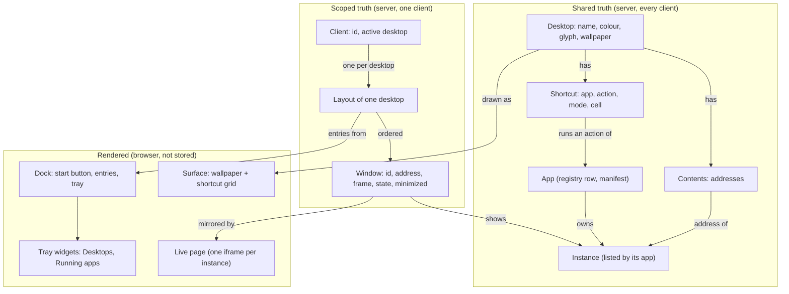

# The desktop interface: concepts and names

Status: draft for alignment (step A of the plan: concepts, then the V1 spec, then implementation).
Audience: the people and agents who will write the V1 spec and implement it.

This document names every concept of the desktop-style system interface, says what each one is, who owns it, and how it relates to the others.
It supersedes the tabbed-dock vocabulary of the [workspace app model](../workspace-app-model/plan-workspace-app-model.md) where the two disagree; everything about apps, instances, addresses, and the app contract stands.
The exact schemas, routes, and file formats will live in the V1 spec beside this file, not here.

## 1. What stays

The workspace app model's lower half is untouched.
An **app** is a supervised program with a manifest, a registry row, and its own origin.
An **instance** is something an app owns, lists, and reports status for.
An **address** (`app:<name>` or `app:<name>?instance=<key>`) is the one way to name an instance.
An **action** is a way to create an instance that an app declares.
A **client** is one browser context with a stored id and a device kind.
The **inventory**, the **instances API**, the **relay**, the **browser-side contract** (`shell:handshake`, `shell:open`, `shell:focused`, `shell:location`, `shell:shown`, `shell:hidden`), and the **embedder relay** to the minds chrome all stay as they are.

The five principles stay too: one owner per fact, the shell is generic and names no app, truth is shared while arrangement is scoped, minimal shell state, no two-phase commits.

One rule of the current frontend is load-bearing and must survive verbatim: **there is one live page (iframe) per instance, machine-wide**, and the element holding it never leaves the DOM.
Windows are positioned boxes that the live-page layer mirrors; they are not the iframes' parents.

## 2. The concepts

| Concept | Was | One line | Owner | Alternatives considered |
|---|---|---|---|---|
| Desktop | project, view | A named, shared collection: what it holds, its shortcuts and their cells, its wallpaper, its identity | Shell, shared | space, screen, room, workspace (taken) |
| Surface | -- | The area of a desktop behind its windows: the wallpaper and the shortcut grid | Rendering of a desktop | canvas, backdrop, stage |
| Wallpaper | -- | The image a desktop's surface shows | Desktop, shared | background |
| Shortcut | shortcut (rail row) | An entry on a desktop's surface that runs an app action, sitting in one grid cell | Desktop, shared | icon (its rendering), pin, launcher tile |
| Window | tab, panel | The rendering of one instance in one client's layout of one desktop, with geometry, a state, and a place in the stack | Layout, per client | pane, frame, card |
| Title bar | tab header | A window's top strip: icon, title, menu, and the window controls | Window | header, chrome |
| Layout | layout | One client's arrangement of one desktop: its windows in stacking order | Shell, per client | arrangement |
| Dock | -- (collides, see 2.9) | The bar along the bottom: start button, one entry per window, system tray | Client (transient), rendered from the layout and the inventory | taskbar, panel, shelf |
| Start button, Start menu | "+" / New Tab page | The dock's launcher and the surface it opens | Client, transient | launcher, new menu |
| System tray | -- | The dock's right end, a row of tray widgets | Dock | status area, notification area |
| Tray widget | -- | One self-contained thing in the tray: V1 ships Desktops and Running apps | Dock | applet, indicator |
| Theme | design system tokens | The token table every component reads: colours, type, radii, metrics | Workspace setting | skin, style |
| Compact mode | device kind `mobile` | The render policy for narrow viewports | Derived at render time | mobile layout, phone mode |

The sections below define each one.

### 2.1 Desktop

A desktop is what a project was, renamed and given a surface.
It has an id (the slugified name, stable across renames), a name, a colour, a glyph, a **contents** set (the addresses it holds, in the order added), its **shortcuts** (each with a grid cell), and its **wallpaper**.
Desktops are shared truth: every client sees the same desktops with the same contents, shortcuts, and wallpaper.
A workspace always has at least one desktop; deleting the last one is refused, and a fresh workspace starts with one default desktop.
There is no "Everything" desktop (see open question 2).

The contents set is many-to-many as today: one instance can be on any number of desktops, and adding it to one never removes it from another.
Its verbs are "Add to desktop" and "Remove from desktop".
An instance leaves every desktop's contents only when it is deleted through the shell.

### 2.2 Surface and wallpaper

The surface is the desktop as drawn: the wallpaper filling the area above the dock, and the shortcut grid over it.
Windows float over the surface; the surface never scrolls.

A wallpaper is a reference to an image plus a fit (`cover` in V1), stored on the desktop.
V1 sources: a bundled set shipped with the shell, and image files the user drops under the shell's data directory, served by a shell route.
A desktop with no wallpaper set shows the theme's default.
The wallpaper is desktop data, not theme data: two desktops can differ, and a theme change leaves them alone.

### 2.3 Shortcut and the shortcut grid

A shortcut is today's rail row, `(app, action, mode)`, plus a **cell** on the grid.
`mode` keeps its meaning: `focus` raises the most recently focused window of that app in this client's layout and runs the action only when there is none; `new` always runs the action.
A shortcut is shared: its cell is stored on the desktop, so a desktop looks the same from every client of the same shape.
Removing every shortcut from a desktop changes nothing about the apps or their instances.
A new desktop is seeded from every registered app's `default_shortcut`, in registry order, laid out in reading order.

The grid is derived from the surface size and the theme's cell metrics, never stored.
A stored cell that falls outside the current grid, or collides with another, is placed at the nearest free cell at render time without rewriting the stored cell, so a phone showing a wide desktop degrades gracefully and the wide arrangement comes back on the wide screen.
Dragging a shortcut writes its new cell.

The shortcut's target is a tagged union with one V1 variant, `action`, so that an `instance` variant (a shortcut to one chat) can be added later without a migration.

### 2.4 Window

A window shows one instance in one client's layout of one desktop.
It has a **window id** (today's tab id: minted when first opened, never reused, and what fills the `{tab}` placeholder of an instance URL), its **address**, its **frame** (the free-floating rectangle), its **state**, whether it is **minimized**, and its **last focused** time.
A layout holds one window per address at most.

Geometry is stored as fractions of the surface (`x`, `y`, `width`, `height` in `0..1`).
Rendering multiplies by the current surface size, clamps to the theme's minimum window size in pixels, and nudges the title bar into view.
This is one policy for "the minds app was resized": every window scales with the surface, and growing the surface back restores the arrangement exactly, because the stored fractions are never rewritten by rendering, only by the user's own drag or resize.

The state is one of `NORMAL` (the frame is shown), `SNAPPED_LEFT`, `SNAPPED_RIGHT` (the window fills that half), or `MAXIMIZED` (the window fills the surface).
The frame is kept through every state, so restore always has somewhere to go.
Minimized is orthogonal: a minimized window keeps its state and returns to it.

The layout's window list **is** the stacking order, last on top; raising a window moves it to the end.
Focus follows the top window.
Clicks into a background window's cross-origin page cannot reach the shell, so the pages of background windows are made inert and the first press raises the window; the page of the top window is interactive.

### 2.5 Title bar and window controls

Left to right: the app icon, the title, the window menu (the three-dot button, directly after the title), then at the right edge minimize, maximize (restore when maximized), close.
No status indicator sits next to the icon.
The title bar is the drag handle; double-click toggles maximize; dragging to the left or right edge snaps to that half; dragging to the top edge maximizes.
The window menu is today's tab menu built from the instance's capabilities: Refresh, Share, Rename, Add to desktop, Remove from desktop, Stop and Start the instance, Stop and Start the app, Delete.

Close removes the window from this client's layout and nothing else: the instance keeps existing (a `referenced` instance is deleted by the shell once nothing references it, as today).
Delete is the menu verb that ends the instance.

### 2.6 Layout

A layout is one client's arrangement of one desktop: the ordered window list.
It is stored on the server, keyed by desktop and client, exactly as today (the client file is the truth, the browser saves the user's gestures with a save id and a base stamp, the shell writes agent ops, every write is broadcast as `layout_updated`).
A client's first visit to a desktop opens one window per entry of the desktop's contents, cascaded; from then on the client's own file is the truth.
The per-device-kind seed files go away with the Everything view and the tabbed arrangement they seeded (see open question 3).

### 2.7 Client and active desktop

A client keeps its active desktop on its server record, as it keeps its active view today.
Two windows of one browser are one client and mirror each other.

### 2.8 Dock, start button, start menu, system tray, tray widgets

The dock is the bar along the bottom of the viewport, on every desktop.
Left to right: the **start button**; one **dock entry** per window of the active desktop in this client's layout, in opening order, minimized windows included and marked; then the **system tray**.
A dock entry shows the app icon and the window title (icon only in compact mode).
Clicking an entry: a minimized window is restored and raised; the top window is minimized; any other window is raised.

The start button opens the **start menu**: in V1, the current New Tab page's content (search, "Open new", the desktop's contents, "Start something", templates) shown as an overlay anchored to the button, one per client, closed by a choice, a click outside, or Escape.
It is not a window and is not persisted.
Opening something from it opens a window on the active desktop.

The system tray is the dock's right end and holds the **tray widgets**, self-contained components that read shell state and offer one popover each.
V1 ships two:

- **Desktops**: one glyph per desktop, the active one marked; click switches; its popover offers "New desktop" and each desktop's settings.
- **Running apps**: one icon per app that is running and has at least one listed instance; click opens a popover listing that app's instances (open or raise on choice) and its actions.

The dock is not a stored object.
It renders from the active layout and the inventory, and its only preference (V1: none; later, auto-hide) would be per client.

### 2.9 The word "dock"

Today "dock" means the dockview surface, and "to dock a tab" means to place it there, in the shell's code, tests, README, and the `manage-layout` and `manage-projects` skills.
The dock of this document is the bottom bar.
The old sense goes away with dockview; the V1 change purges it from every file it touches so the word has one meaning.

### 2.10 Theme

A theme is one table of CSS custom properties: the existing `--c-*` colour tokens and type roles of `system/libs/workspace_ui/src/base.css`, plus the desktop's own tokens (title bar height, dock height, shortcut cell size, minimum window size, window radius, the default wallpaper).
Every component styles itself from tokens and semantic utilities only; no component carries a literal colour or size.
The metrics that behaviour needs (cell size, dock height, minimum window size) are read once from the computed tokens by one function, so a theme that changes the dock height moves the windows with it and no number lives in two places.
V1 ships one theme; a second theme is a second token file selected by a workspace setting.
The style-versus-behaviour split is per component: each of window, title bar, shortcut, dock, dock entry, tray widget, surface, and wallpaper is a pure view over a record, with its look in the token layer and its gestures in one module.

### 2.11 Compact mode

Compact mode is a render policy chosen from the viewport width at render time, not a stored kind.
Under it, windows render maximized whatever their stored state (the stored frame is untouched), the dock shows icons only and a smaller start button, the shortcut grid uses the theme's compact cell size, and window drag and resize are disabled while shortcut drag stays.
Everything else is the same model, the same layout file, and the same verbs.
`device_kind` keeps existing on the client record for analytics and the handshake, but nothing branches on it.

## 3. How they relate

Ownership, in the table form the app model uses:

| Fact or verb | Owner |
|---|---|
| Which apps and instances exist, their titles, status, icons | Apps, via the manifest, registry, and instances API (unchanged) |
| Desktop names, colours, glyphs, contents, shortcuts and their cells, wallpaper | Shell, shared |
| Add to desktop, Remove from desktop, place a shortcut, set a wallpaper | Shell, shared |
| Which windows a client has on a desktop, their frames, states, order, last focused; the active desktop | Shell, per client |
| Open, raise, minimize, maximize, snap, move, resize, close a window | Shell, per client |
| Which entries the dock shows, which tray widgets exist | Derived in the browser from the layout and the inventory |
| Theme selection | Shell, a workspace setting |

## 4. Verbs

Per window: open, raise (focus), minimize, restore, maximize, snap left, snap right, move, resize, close, and the instance verbs of the window menu.
Per desktop: create, rename, recolour, delete, set wallpaper, add and remove contents, add, move, and remove shortcuts, switch to.
The agent-facing `layout.py` keeps `list`, `inspect`, `context`, `views`, `load`, `open`, `focus`, `close`, `rename`, `delete`, `stop`, `start`, `refresh`, `replace-url`, `shortcuts`, `shortcut set`, `shortcut remove`; `split` and `move` with tree directions become `place <address> left|right|maximized|<fractions>` and `minimize`; `maximize` and `restore` become document ops rather than transient messages, since a window's state is now stored.
Every op still targets exactly one client and is applied by the shell to that client's layout file.

## 5. What goes away

- dockview, its serialized document, the Python editor over it (`dockview_document.py`), tab groups, tiled splits, and the vendor CSS overrides.
- The left rail (`Sidebar.ts`) and its sixteen responsibilities, redistributed: view identity and switching to the Desktops tray widget; shortcut rows to the surface; the All-apps popover and search to the start menu; the tab list to the dock entries, the Running apps widget, and the start menu's "On this desktop" section; the row menu to the window menu; menu placement (`placeMenu`) to a shared component.
- The New Tab page as a panel: the "dock is never empty" rule, launcher retirement, and "a tab docking into a launcher's pane answers it". An empty desktop is a surface with shortcuts.
- The Everything view and the per-device seed files (open questions 2 and 3).
- Project colour and glyph stay (the Desktops widget draws them).

## 6. What each prototype contributes

From Kanjun's `desktop-mode`: the snap zones with the 16 px edge threshold and the fractional re-hang on un-snap, the "scale from the user's own placement, never from the last clamped result" resize policy (here as fractional frames), the inert-background-page rule for click-to-raise, the dock entry click policy, the tray's status summary idea (as a later widget), and the Playwright coverage of windows.
Not taken: dockview floating groups, window state fanned across panel params, the pet subsystem, the chat app's draft flow, the hard-coded wallpaper.

From Gleb's `desktop-shell`: the shape of the desktop document and its pure editors on both sides of the wire (`desktop_document.py` and `windowState.ts`), the icon grid with nearest-free-cell collision and drawn-position-versus-saved-cell, the resize edges, the chat window's instance list keyed off a manifest capability rather than the app's name, one iframe per instance held alive across list picks, and the `GET /_instances/search` split.
Not taken: the god-module `DesktopShell.ts` and `instanceRail.ts` (the same logic re-cut into components over one store), close-means-stop, agent `close` meaning minimize, pixel geometry, mngr labels leaking into the shell for sub-agent grouping.

## 7. Open questions

Each with a recommendation; the V1 spec assumes the recommendation unless this section is revised.

1. **Keep dockview?**
   Neither prototype kept it usefully: Kanjun's fights its floating groups (vendor CSS overrides, N copies of one window's state, no maximize), Gleb's dropped it with no replacement dependency at about 2,500 lines.
   The free-floating parts of the current shell (`liveSurfaces.ts`) never depended on it; only the slot rectangle did.
   Recommendation: drop it; write the window manager as pure geometry and state functions over the layout record plus thin Mithril views on pointer events, with no new npm dependency (interact.js or WinBox would impose their own DOM and CSS on the very components the theme split needs to own).
   Cost accepted: tab groups and tiled splits are gone.
2. **The Everything view.**
   It was the unfiltered view, the fresh-install landing, and the fallback after a project delete.
   Recommendation: drop it.
   The Running apps widget and the start menu's search cover "everything on the machine"; a fresh workspace lands on its one default desktop; deleting the last desktop is refused.
3. **The shared contents set.**
   Keep it (desktops are collections of windows across devices, and referenced-lifetime GC counts it) or drop it (a layout per client is the whole truth, simpler)?
   Recommendation: keep it, and give it the job the seed files had: a client's first visit to a desktop opens a window for each address in the contents, so a desktop feels like the same collection on every device.
   Drop the per-device-kind seed files.
4. **Where shortcut cells live.**
   Shared on the desktop, or per client in the layout?
   Recommendation: shared, fitted to the current grid at render time without rewriting.
   A per-client arrangement would make the same desktop look different on the same laptop after a browser reset, which is not what a desktop does.
5. **Window geometry representation.**
   Pixels plus the surface size they were placed on (Kanjun), pixels nudged into view (Gleb), or fractions of the surface.
   Recommendation: fractions.
   It is Kanjun's policy with no extra state, agent ops can place a window without knowing any pixel size, and snap zones are literal fractions.
6. **Dock entries: windows or running instances?**
   Recommendation: windows of the active desktop in this client, as asked; running things without a window are the Running apps widget's job.
7. **Start menu in V1: overlay or window?**
   Recommendation: an overlay anchored to the start button, not persisted, reusing the New Tab page's content and models unchanged.
   This deletes the launcher-panel rules and makes the shortcut grid the only empty state.
8. **The chat window's list pane.**
   Recommendation: adopt Gleb's manifest capability (`instance_list = true`, alternatives `browses_instances`, `sidebar`), rendered by the shell inside the window from the inventory, with picks re-addressing the window and held pages kept alive by the live-page layer.
   Sub-agent nesting comes from an optional `parent` key on the instance record, added to the instances API, not from mngr labels.
   A sub-agent view held but not shown is unreferenced and may be deleted; it is `referenced` and cheap to recreate, so this is accepted.
9. **Close semantics on the window's close button.**
   Gleb's close stopped the instance; today's close undocks.
   Recommendation: close removes the window and touches the instance only through the referenced-lifetime rule, exactly as today; Stop and Delete stay menu verbs.
10. **Mobile as a mode or a device kind.**
    Recommendation: a render policy from viewport width (compact mode), never a stored kind, so a phone and a narrow desktop window behave the same and a rotated tablet switches live.
11. **The `{tab}` placeholder and the `tab-` id prefix.**
    Renaming them to `{window}` touches the terminal app and every instance URL.
    Recommendation: the shell's type becomes `WindowId` and the wire literals stay `{tab}` and `tab-<hex>` in V1, with a `CLEANUP:` note.
12. **Agent verbs `split` and `move`.**
    They are tree operations with no meaning on a stack.
    Recommendation: replace them with `place` (left, right, maximized, or fractions) and `minimize`; keep the client-targeting and the "no browser needed" rule.
13. **Theme selection storage.**
    Recommendation: a shell setting under the shell's own data directory, one CSS token file per theme, V1 ships one; the wallpaper is desktop data and outside the theme.
14. **One store, not module globals.**
    Both prototypes ended in a 2,000 to 3,700 line module of file-scope mutable state.
    Recommendation: one implementation class holding the client's desktop state (the layout, the gesture in progress, the open popover) with pure reducers in separate modules, and components that take records and callbacks.
    Two desktops on one page then cost nothing, and the reducers are the unit-test surface.
