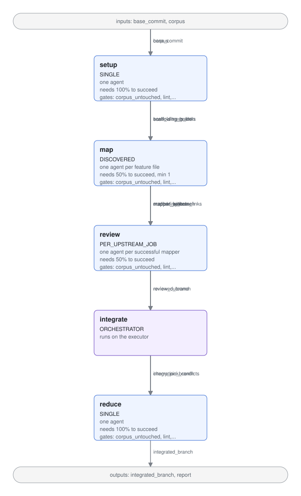

# Behaviors map-reduce: re-homing the witness pipeline off TMR

## Purpose

This spec designs the successor to `mngr tmr-behaviors`: the pipeline that fans agents out over a behavior corpus (`<project>/behaviors/`) and converges the tests that witness it.
The current pipeline is a second recipe inside `libs/mngr_tmr`, so it inherits TMR's CI-and-modal shape, its outcome and report models, and its fixed map-then-reduce topology, while the behaviors work needs a different topology and needs to run on a laptop with no setup.
The design re-homes the pipeline into its own package, builds it on the agent-launching primitives of `libs/mngr_mapreduce` rather than on `mngr_tmr`, adds a setup stage and a per-mapper review stage, and replaces prose rules with mechanical gates wherever a rule can be checked.

Audience: the owner of the behaviors work, the maintainer of `mngr_tmr` and `mngr_mapreduce`, and whoever implements the phases below.
This is a design document to align on before implementation.
The implementation plan (a `blueprint/` entry) follows once the items under "Decisions" are settled.

Related documents:

- `.claude/skills/behaviors/SKILL.md` defines the behavior language (layer 1); this design does not change it.
- `.agents/skills/tmr-behaviors/SKILL.md` was the runbook for the TMR pipeline; `.agents/skills/witness/SKILL.md` replaces it.
- `blueprint/tmr-behaviors/plan-tmr-behaviors.md` placed the current pipeline in `libs/mngr_tmr`; this spec reverses that placement decision.
- `specs/tmr-bounded-convergence-and-normalization.md` describes TMR's mapper convergence and reducer normalization model, which the current behaviors recipe mirrors.
- `libs/mngr_tmr/README.md` and `libs/mngr_mapreduce/README.md` describe the two libraries the current pipeline sits on.

## Background: the current pipeline

`mngr tmr-behaviors` (`libs/mngr_tmr/imbue/mngr_tmr/behavior_cli.py`, `behavior_recipe.py`, `behavior_prompts.py`, `behavior_report.py`) is a `MapReduceRecipe` subclass run by `imbue.mngr_mapreduce.cli.run_mapreduce`.
Discovery scans the corpus with `imbue.mngr_behaviors.corpus.scan_corpus` and creates one mapper task per `.feature` file.
Each mapper is a Claude agent created through the in-process `mngr` API on the chosen provider, given a rendered `behavior_mapper.j2` prompt, and expected to publish a tarball containing an outcome JSON and a git bundle of its branch.
When every mapper has published or timed out, one reducer agent receives every mapper archive by rsync, fetches the bundles, filters them with a `should_pull` predicate, cherry-picks the surviving commits, deduplicates scaffolding, runs `mngr behaviors matrix`, and publishes an integrated branch.
The operator then restacks, consolidates changelog entries, formats, re-runs release witnesses, pushes, and opens a PR by hand.

The pipeline has run for real on three corpora.
The `libs/mngr_forward` run (MIND-127, merged as PR #735) is the reference case for this design: 70 units in 11 feature files, 10 mappers, one reducer, raw output of +1674 lines into three existing test files, followed by 16 hand-written cleanup commits that removed 1166 lines of duplication.

The corpus is now fully witnessed on `main`: 70 units, 54 `full`, 16 `partial`, 0 `none`, from 78 witnessing test functions in `server_test.py`, `cookie_test.py`, and `auth_test.py`.
This design holds that corpus and those tests constant as the baseline against which the new pipeline is validated.

## Problems

Each problem names its evidence and the part of the design that addresses it.

| Id | Problem | Evidence | Addressed by |
|---|---|---|---|
| P1 | The behaviors pipeline depends on TMR internals: bundle glue, template loader, report and outcome models, the `--` split command class, S3 upload, and the `tmr` plugin entry point. | `behavior_recipe.py:50-57`, `behavior_prompts.py:20-23`, `behavior_report.py:38-58`, `behavior_cli.py:23-24`, `plugin.py` | Placement and naming |
| P2 | The topology is fixed at discover, snapshot, map, reduce; there is no setup stage and no per-mapper review stage. | `mngr_mapreduce/cli.py:475-551` | The stage primitive; the four stages |
| P3 | Mappers duplicate scaffolding that the reducer does not remove. | PR #735 raw output inlined the app recipe 51 times and the agent-registration lines 29 times; the reducer's normalize commit fixed two duplicated import lines | Setup stage; existing-witness injection; the annealing pass; duplication metrics in validation |
| P4 | Mapper rules are enforced by nothing: units reported are never compared with units assigned, the "name the clause" rule lives only in one project's variant prompt, `PARTIAL_STEADY` honesty is checked by a human, and an assertion with no clause shipped. | `behavior_mapper.j2`, `libs/mngr_forward/tmr/behaviors_mapper.j2:54-58`, SKILL.md step 3 | Mechanical gates; review stage; clause trace |
| P5 | `FULL` is defined as the absence of `partial=` notes, so a unit witnessed clause-by-clause can never be `FULL`, and clearing a truthful note is the only route to `FULL`. | MIND-226; `sessions-unforgeable` carries ten honest witnesses and reads `partial` | Verdicts and the clause trace |
| P6 | A mapper whose archive cannot be pulled is recorded as successful, and the behaviors reducer is blind to failed mappers. | MIND-222 defect 2; `orchestration.py:98-115`; no `on_all_mappers_finalized` override in `behavior_recipe.py` | Gates: missing evidence is failure; run manifest |
| P7 | Recovery (`--reintegrate`) rediscovers agents through `mngr list --format json`, which returns nothing, and through a label that is never stamped. | MIND-224; `cli.py:628` | Run manifest and `--resume` |
| P8 | A local run needs a hand-registered skip-permissions agent type and a Claude trust entry, both user-scope config edits. | MIND-157; SKILL.md step 0 | Run-scoped agent type |
| P9 | `--provider modal` has never worked and `--provider docker` is unverified; create templates lose every key except build and start args. | MIND-223 (defect 3 open); `launching.py:146-153` | Providers; validation runs V2 and V3 |
| P10 | Hosts are never destroyed, so a laptop accumulates stopped containers and committed images. | `libs/mngr_tmr/README.md:68-75`; `providers/docker/instance.py:1577-1601` | Cleanup |
| P11 | Mappers write one changelog file each, which the operator merges by hand. | `behavior_mapper.j2` has no "do not write a changelog" line; SKILL.md step 4.4 | Changelog policy; a gate |
| P12 | The orchestrator dies on a transient network error and, when reaped, loses unpulled work. | MIND-222 defect 1; MIND-156 | Run manifest and `--resume` |
| P13 | There is no way to re-run a single feature file. | SKILL.md step 3 | `--feature` |
| P14 | In a colocated jj repo the base commit is `HEAD`, one commit behind `@`. | MIND-225 | Base commit resolution |
| P15 | The run-regime rules (create regime, name the clause, closed versus open world) are duplicated across project variants instead of living in the packaged contract. | `libs/mngr_forward/tmr/behaviors_mapper.j2:30-97`, `libs/mngr_claude/tmr/behaviors_mapper.j2:34-47` | Prompt contract |
| P16 | The reducer does mechanical work (fetch bundles, filter, cherry-pick) as an LLM, so integration is non-deterministic. | `behavior_reducer.j2:25-93` | Mechanical integration in the reduce stage |

Out of scope for this design, and tracked elsewhere: the message-delivery evidence-probe false negatives (MIND-158) live in `mngr`'s TUI delivery; running the orchestrator in CI (MIND-156) is a follow-up once local, docker, and modal runs work.

## Goals

- Run the whole pipeline from a developer checkout with one command and no prior configuration, on `local`, `docker`, or `modal`.
- Support the topology setup, map, review, reduce, with each stage's output mechanically gated before the next stage starts.
- Make every rule that can be checked mechanically a gate, and route every rule that cannot through an adversarial reviewer with evidence in its outcome.
- Produce a branch the operator reviews, plus a report, with the changelog already written.
- Depend on `mngr_mapreduce` for launching agents, pulling their outputs, and managing hosts; depend on nothing in `mngr_tmr`.
- Keep the behavior language, the `mngr behaviors` CLI, and the `libs/mngr_behaviors` package unchanged.

## Non-goals

- Opening pull requests, uploading reports to S3, or wiring a GitHub workflow.
- Changing any corpus, including the mandated README incipit.
- Changing the `witnesses` marker or the matrix vocabulary.
- Fixing TMR's own recipe (`mngr tmr`).

## Constraints

- The operator checkout can run `uv run mngr`, `git`, and `ruff`, and can import the target project for `pytest --collect-only`; it is never required to run the project's tests.
- Project tests run only on agent hosts, and the results come back as files.
- `libs/mngr_mapreduce` and `libs/mngr_tmr` have a maintainer whose agreement is required for the changes listed under "What changes in mngr_mapreduce".
- The corpus README incipit mandated by `REQUIRED_README_INCIPIT` is corpus content; it now names the `behaviors` skill (the language reference), and every corpus README was rewritten in the same commit that retired the TMR recipe.

## Design

### The pipeline at a glance



The diagram is rendered from `WITNESS_PIPELINE` in `libs/mngr_witness/imbue/mngr_witness/pipeline.py`, the same declarative object the executor will iterate; the model it instantiates and the SVG renderer live in `mngr_mapreduce`.
`pipeline_test.py` fails when the committed SVG drifts from the model, and `uv run python libs/mngr_mapreduce/scripts/render_pipeline_svg.py imbue.mngr_witness.pipeline:WITNESS_PIPELINE specs/behaviors-mapreduce/pipeline.svg` regenerates it.

Every arrow is a fetched git branch in the operator checkout plus an extracted archive under the output directory; nothing lives only on an agent host once its stage is over.

### Placement and naming

The pipeline is a new plugin package, `libs/mngr_witness`, registering the top-level command `mngr witness` (decision D1).
It depends on `imbue-mngr`, `imbue-mngr-mapreduce`, `imbue-mngr-behaviors`, and `jinja2`.
It does not depend on `imbue-mngr-tmr`, and `mngr_tmr` does not depend on it.

Modules:

- `cli.py`: the `witness` command and its options.
- `pipeline.py`: `WITNESS_PIPELINE`, the witness instance of `mngr_mapreduce`'s declarative pipeline model, that the executor iterates and the diagram above is rendered from.
- `bindings.py`: the witness bindings for `mngr_mapreduce`'s executor: one agent step binding per stage that discovers the stage's jobs and builds their prompts, the integrate orchestrator step, and the observers that render the report.
- `gates.py`: the mechanical checks, one gate binding per gate name, each a pure function of a branch name, an archive directory, and the corpus scan.
- `outcomes.py`: the outcome models for each stage, with parsers.
- `resume.py`: `--resume`, reading the manifest `mngr_mapreduce`'s executor writes.
- `prompts.py` and `prompt_assets/{setup,mapper,reviewer,annealer}.j2`: the prompt contracts and the variant mechanism.
- `report.py` and `report_assets/`: the HTML report.
- `agent_type.py`: the `witness-claude` agent type, claude with the unattended switches on.

The blueprint's earlier reasons for keeping `libs/mngr_behaviors` untouched still hold: it stays a small layer-1 library with a clean PyPI trajectory, and the pipeline imports it.

### Command line

```text
mngr witness --root <corpus> [--tests <path>]... [--feature <root-relative .feature path>]...
             [--area <folder>] [--tag <tag>] [--unit <kind>]
             [--provider <name>] [--node-provider <node>=<name>]... [--node-env <node>:KEY=VALUE]...
             [--agent-type <name>] [--max-running-agents <n>] [--timeout <seconds>]
             [--output-dir <dir>] [--name <slug>] [--changelog-branch <name>]
             [--keep-hosts] [--resume <output-dir>]
```

`--root` is the only required option.
`--tests` defaults to the corpus root's parent, as `mngr behaviors matrix` does.
`--feature` selects feature files by path and composes with the layer-1 filters `--area`, `--tag`, and `--unit`; running one feature file on top of a previous run's integrated branch is how a single mapper is redone (P13).
The placement flags build the execution plan: `--provider` is the default placement, `--node-provider` and `--node-env` override one node (`setup`, `map`, `review`, or `reduce`).
`--timeout` is the per-agent wall clock for every node and defaults to one hour, as today.
`--name` defaults to `witness` and prefixes every agent, host, and branch name.

### The executor

The pipeline object is the program; `mngr_mapreduce` supplies the interpreter and the witness package supplies the runtime.
Nothing in the model knows how to run; behavior attaches to the model's names through bindings, and one executor runs any bound pipeline.
The model and its executor are `mngr_mapreduce`'s arbitrary-topology pipelines, designed in `specs/mapreduce-pipeline-topology/`; this section says only how the witness pipeline uses them.

The four stages of this document are five nodes of a `Pipeline`: `setup`, `map`, `review`, `integrate`, and `reduce`, where `integrate` is the orchestrator half of the reduce stage and `reduce` is its annealer agent.
A node declares the artifacts it needs and produces, and the executor derives the order from that; a node's fan-out is machine-readable: `setup` and `reduce` run one job (`SINGLE`), `map` discovers one job per selected feature file (`DISCOVERED`), and `review` runs one job per successful mapper (`PER_UPSTREAM_JOB` over the mapper branches), so a mapper that failed a gate is never reviewed.
`map` and `review` declare a required completion of one half: a failed mapper or reviewer is an escalation in the report, and only a run in which most of them fail stops.
`setup` and `reduce` require their one job to succeed, so a failed setup stops the run before any mapper launches and a failed annealer leaves the run red.

The prompt templates are part of the pipeline.
`Pipeline.template_by_name` carries the packaged family (the four node templates and the partials they include), and each node's `prompt_template` is the packaged template or the project's variant of it, which extends the packaged one by name; the run-wide facts (corpus root, test roots, publish snippet, changelog branch, file names, commands) are the pipeline's parameters, supplied once as the execution's context, and each binding supplies the per-job values, all strings, with the sections that list units, existing witnesses, or branches rendered before they are handed over.
A template that reads a name nothing supplies is refused when the pipeline is built, so a hole in a prompt is caught before any agent launches.

`AbstractPipelineExecutor` (`mngr_mapreduce/executor.py`) owns everything that is the same on every provider: the scheduling loop, the fan-out arithmetic, agent and branch naming (`<name>-<execution>-<node>-<slug>` and `<name>/<execution>/<node>/<slug>`, with the slug sanitized to agent-name characters), prompt rendering, launching with the configured delay, polling for archives, per-agent timeouts, pulling archives, fetching branch bundles into the operator checkout, running the node's gates on each result, and telling observers after every change.
It leaves seven methods abstract, and they are the whole provider surface: `provision_hosts`, `launch_agent`, `is_published`, `pull_outputs`, `fetch_branch`, `stop_agent`, and `release_hosts`.
A node that falls short of its required completion halts the run: every agent still in flight is stopped, every host is released, and the nodes that never ran are recorded as skipped.

An Executor performs an Execution, and an Execution has an `ExecutionPlan`: a typed description of everything about an execution that is not the pipeline, a default `NodePlacement` (provider, agent type, environment, create templates, agents per host, launch parallelism, running cap, agent timeout) with per-node overrides, plus where the execution reads and writes and whether it keeps its hosts.
"Run the witness pipeline all locally" is a plan with a local default and no overrides; "mappers on modal, reduce on my laptop with a push token" is a modal default and one override for the reduce node, which is also how a credential reaches one node and no other.
The plan is validated against the pipeline before anything launches, as the bindings and the context are: an override naming a node the pipeline lacks, a provider `mngr` cannot resolve, or a parameter the execution does not supply is an error.
The CLI builds the plan from flags.

There is one executor for `mngr`, `MngrPipelineExecutor` (`mngr_mapreduce/mngr_executor.py`), because `mngr` already serves every provider through one call and the differences between providers are values in the plan, not types.
It places each node where its placement says: a node on the local provider runs on the operator's host in mirror clones; a node on a provider that supports snapshots gets a snapshot and a host pool of its own, its agents placed as worktrees off the pool's shared clone, both destroyed when the node ends unless the plan keeps hosts; a node on any other provider gets a fresh host per agent.
Publishing, pulling, and stopping are the same calls the recipe path makes.
The per-node snapshot is what lets a node start from branches an earlier node produced: `mngr` fails agent creation outright when a worktree's base ref is absent from the pooled clone, and the snapshotter mirrors the operator checkout as it is at that moment.

Bindings (`mngr_mapreduce/bindings.py`, `interfaces.py`) are the behavior, one interface per fan-out shape: a `SINGLE` binding builds the node's one job, a `DISCOVERED` binding lists them, a `PER_UPSTREAM_JOB` binding turns one successful upstream result into a job or declines it, an orchestrator binding does a node's work in the executor's process, a gate binding checks one rule against a job's branch and archive, and observers receive the execution after every change.
They are registered against the pipeline's node and gate names, and `assert_pipeline_is_bound` rejects a pipeline with an unbound node, a binding of the wrong shape, or an unbound gate before any agent launches.

```python
class Job(FrozenModel):
    slug: str                        # feature-file slug, or "scaffold" / "integrated"
    base_ref: str                    # commit or branch in the operator checkout the agent starts from
    template_variables: dict[str, str]  # the node's job variables, rendered over the execution's context
    inputs_dir: Path | None          # copied into the agent's work dir before the prompt is sent

class JobResult(FrozenModel):
    job: Job
    agent_name: AgentName     # <name>-<execution>-<node>-<slug>
    branch_name: str          # <name>/<execution>/<node>/<slug>, fetched into the operator checkout
    archive_dir: Path | None  # <output_dir>/<node>/<agent_name>/, None when nothing was published
    is_branch_applied: bool   # False when the agent committed nothing, which is a legitimate no-op
    error_summary: str | None
    gate_results: tuple[GateResult, ...]
    is_successful: bool       # published, no error, every gate passed
```

Semantics the executor guarantees:

- Agents are created with `TransferMode.GIT_MIRROR` from the operator checkout, on a fresh branch at the job's base ref.
- The agent publishes `$MNGR_AGENT_STATE_DIR/plugin/mapreduce/outputs.tar.gz` exactly as today; the archive must contain `test_output/outcome.json` for the node and, when the agent committed anything, `branch.bundle`; the publish snippet that writes both lives in `mngr_mapreduce/bundle.py`.
- A missing archive, an archive that cannot be pulled, a bundle that cannot be applied, a failed launch, and a timeout are all failed job results, never exceptions out of the executor and never silent successes; an agent that published an archive but committed nothing is a success whose branch is absent, and the gates are told so.
- The `Execution` (identity, context, plan, and every node outcome so far) is what bindings read and what `ManifestWriter` serializes to `<output_dir>/execution.json` after every node ends, so the review node discovers the successful mapper results from it rather than from `mngr list`.
- A node's agents launch concurrently up to the placement's launch parallelism, and at most its running cap are live at once; the executor tops up from the queue as agents finish.

### Stage 1: setup

One agent, from the run's base commit.

Inputs in the prompt: the corpus root, the table of every unit in scope (coordinate, kind, name, file, steps, in-scope invariants), the test roots, and the project variant's guidance.

Its job:

- Read the corpus and the existing test tree, and identify the fixtures, factories, and helpers the corpus's scenario families need (application builders, clients, credential stores, backend stubs, and whatever the project's surface calls for).
- Where those exist, do nothing to them; where they are missing, add them in the project's conventional places (`conftest.py`, `testing.py`) as one `[SETUP]` commit.
- Write `scaffolding_guide.md` into its archive: one entry per fixture or helper, stating its name, location, what it provides, and when a witnessing test should use it.
- Run `pytest --collect-only` with the witness collection plugin over the test roots and ship the raw links as `witness_links.jsonl` (the harvest half of `mngr behaviors matrix`), so the orchestrator knows which units are already witnessed and by which tests.

The setup agent never writes a witnessing test and never edits the corpus.
If the tree already has what the corpus needs, its commit is empty and the run proceeds from the base commit; the guide is still written.

Gates: corpus untouched; lint clean on touched files; touched paths are test paths only (see "Mechanical gates" for the path rule); `witness_links.jsonl` present and joining cleanly against the corpus.
A failed setup stage stops the run before any mapper launches.

The scaffolding commit becomes the base for every mapper, so mappers cannot recreate what the setup stage provided, and the guide is injected verbatim into every mapper prompt.
On `local` this is just a commit in the operator checkout that the mirror push carries.
On `docker` and `modal` the setup agent runs on a host of its own, and the snapshot that seeds the mapper host pool is taken after the scaffolding commit exists in the operator checkout, so the pool's shared clone contains it.

### Stage 2: map

One agent per feature file selected by the filters, from the setup commit.

Inputs in the prompt: the feature file path, its units with steps and in-scope invariants, each unit's existing witnesses (from the setup stage's links, joined against the corpus), the scaffolding guide, the `mngr behaviors` self-serve commands, and the project variant's guidance.

The contract is the current packaged mapper contract with these changes:

- The run-regime rules move into the packaged template (P15): the create regime, "name the clause before writing an assertion; if you cannot name one, do not write it", "match the clause's precision", the closed-world versus open-world verdict rules, and "duplicating coverage that already exists is a defect".
- The outcome carries a clause trace (see "Verdicts and the clause trace").
- The mapper does not write changelog entries; the annealer writes them.
- The mapper runs every test its trace names, touched or not, by node id, and ships the junit XML of that run plus `witness_links.jsonl` from a collect-only pass over the test roots; an existing witness it leaves alone is therefore re-verified rather than assumed.
- The mapper uses the fixtures the guide names; it may add a fixture only when the guide has none for the need, and it records the addition under `scaffolding_added` so the annealer can reconcile duplicates across mappers.
- New tests go to the generation location and existing witnesses are adopted where they are (see "Where generated tests go").

Everything else stays: the corpus is read-only; forward and backward convergence; one commit per change kind with `[KIND] coords: summary`; `FIX_IMPL` when the implementation diverges from the behavior; `behavior_problems` as the only channel for proposed corpus edits; `blockers` for shared-setup needs.

Gates per mapper branch: corpus untouched; lint clean on touched files; commit paths obey the kind rule (only `[FIX_IMPL]` commits may touch non-test paths); no changelog file added; the outcome parses and reports exactly the assigned units; `witness_links.jsonl` present, no broken links, and every unit with a verdict other than `NONE` has at least one link; junit present and every node id claimed as a witness passed.
A mapper branch that fails a gate is not reviewed and not integrated; its failures are escalations in the report, and the feature file is re-runnable with `--feature`.

#### Where generated tests go

Witnesses accumulate wherever earlier work put them, so the placement rule has two halves (decision D6):

- Generation: a unit with no witness gets its test in a well-structured, discoverable location, which by default is a `witnesses` package inside the project's importable package, mirroring the corpus folders, with one module per feature file named by the project's test-kind convention.
  For `libs/mngr_forward`, the units of `authentication/signin.feature` go to `libs/mngr_forward/imbue/mngr_forward/witnesses/authentication/signin_test.py`, with blank `__init__.py` files so pytest collects the package.
- Adoption: a unit that already has witnesses anywhere under the test roots (known from the setup stage's links) keeps them; the mapper extends or corrects those tests in place and never creates a parallel witness in the generation location.

Both halves are prose in the packaged mapper template's `placement` block, so a project variant can move the generation location or change the adoption rule.
The setup stage creates the package skeleton when the generation location does not exist yet.

### Stage 3: review

One agent per accepted mapper branch, from that branch's tip, with the mapper's archive as its input directory.

The reviewer is adversarial: its job is to prove the mapper wrong, and to fix what it can.
For each unit in the task:

- Check the trace: every clause the verdict claims must have an assertion that exists in the test source and actually witnesses that clause; an assertion that traces to no clause is removed as gold-plating.
- Check the claim (designed below, deferred by decision D4): break a clause's behavior in the implementation, run the witnessing tests, confirm at least one fails, and restore the implementation, recording each check in the outcome; the schema gains that field when the check is enabled.
  No planned run performs this check, so whether a traced assertion actually witnesses its clause rests on the reviewer's reading until it is enabled.
- Check honesty: every `partial=` note states exactly what the test does not cover; `PARTIAL_STEADY` is claimed only for open-world residue.
- Check duplication: a new test that duplicates an existing witness of the same unit is removed in favor of extending the existing one.
- Check scope: assertions match the clause's precision, not more.

#### Worked example: one mutation check (deferred)

This check is designed and deferred (decision D4); the example shows what it would enforce and what it would cost.

The unit `authentication.authenticate-sets-session` in `libs/mngr_forward/behaviors/authentication/signin.feature` has three clauses:

```gherkin
  @authenticate-sets-session
  Scenario: Reaching the authentication endpoint with the code establishes the session
    When a browser reaches the authentication endpoint carrying the one-time code
    Then the code is spent
    And a session cookie is set
    And the browser is redirected to the bare-origin home page "/"
```

Suppose the mapper created this witness and traced its assertions as follows:

| Clause | Traced assertion |
|---|---|
| `Then the code is spent` | `assert response.status_code == 307` |
| `And a session cookie is set` | `assert MNGR_FORWARD_SESSION_COOKIE_NAME in response.cookies` |
| `And the browser is redirected to the bare-origin home page "/"` | `assert response.headers["location"] == "/"` |

The implementation is `_handle_authenticate` in `libs/mngr_forward/imbue/mngr_forward/server.py`, which validates and consumes the code, mints a cookie, and returns a 307 to `/`.
The reviewer picks the clause most likely to be asserted vacuously, `Then the code is spent`, and runs one check.
First it breaks exactly that clause with a one-line edit that puts the code back after it is consumed, so the code is never spent:

```diff
     is_valid = auth_store.validate_and_consume_code(code=code)
+    auth_store.add_one_time_code(code=code)
```

Then it runs only the witnessing test, and restores the implementation before doing anything else:

```bash
uv run pytest "libs/mngr_forward/imbue/mngr_forward/server_test.py::test_authenticate_consumes_otp_and_sets_cookie" -q
git checkout -- libs/mngr_forward/imbue/mngr_forward/server.py
```

With the trace above, the test still passes: a 307 is returned whether or not the code was consumed, so the traced assertion never depended on the clause.
The reviewer records the check and acts on it:

```json
{"coordinate": "authentication.authenticate-sets-session", "clause": "Then the code is spent",
 "node_id": "libs/mngr_forward/imbue/mngr_forward/server_test.py::test_authenticate_consumes_otp_and_sets_cookie",
 "mutation": "re-add the code after consuming it, so it is never spent", "failed_when_broken": false}
```

The finding is `missing_clause`; the fix is to re-present the same code and assert it is refused, which is what the hand-written test on `main` does (`assert response2.status_code == 403`).
The reviewer adds that assertion in a `[REVIEW]` commit, re-runs the same check, gets `failed_when_broken: true`, and retraces the clause to the new assertion.
Had it been unable to fix the test, it would have downgraded the verdict to `PARTIAL_IMPROVABLE` and left the finding unresolved.

The other two clauses break just as cheaply (delete the `_set_forward_session_cookie` call; change the `Location` header to `/login`), and each check is one edit, one single-test run, and one `git checkout`, a few seconds each on this project.
When enabled, the check applies only to units whose witnesses the run created or changed, at least one clause per `FULL` unit, so a run on a fully witnessed corpus would perform none.

The reviewer commits its corrections as `[REVIEW] coords: summary` commits on top of the mapper branch, writes its own per-unit verdicts and trace (which replace the mapper's claims from here on), and ships junit and `witness_links.jsonl` evidence.
When correcting an over-fitted test reveals that the implementation diverges from a clause, the reviewer fixes the implementation in a `[FIX_IMPL]` commit under the same rule as mappers, since a green branch with a wrong assertion is worse than an honest implementation fix.
When enabled, mutation checks happen in the working tree and are reverted before any commit; a mutation that leaks into a `[FIX_IMPL]` commit is caught by the human review those commits get today.
When it cannot fix a unit it sets the unit's verdict honestly and records a finding; when a whole branch is unsound it sets `branch_accepted` to false.

Gates per reviewed branch: all map-stage gates re-run on the reviewed branch; `[REVIEW]` commits touch test paths only, so no scratch edit to the implementation can ride in a review commit; the reviewer's verdicts are consistent with its evidence (a `FULL` unit has every clause in the trace, and every traced assertion string occurs in the test source at the branch tip).

The mutation check is the one mechanism in this design that would enforce "name the clause" by execution rather than by reading; it is designed here and deferred (decision D4).
In the planned runs the rule is enforced by the `trace` gate, which proves the traced assertion exists, and by the reviewer's reading, which judges whether it witnesses the clause.

### Stage 4: reduce

The reduce stage has a mechanical half and an agent half.

Mechanical integration, in the orchestrator (the `integrate` node): create `<name>/<execution>/integrate/integration` at the setup commit and cherry-pick each reviewed branch's commits in corpus order, where a reviewed branch is the reviewer's when it committed and the mapper's when only the mapper did.
A cherry-pick conflict is recorded (branch, commit, conflicting paths), the cherry-pick is aborted, and that branch is handed to the annealer as unintegrated input.
When nothing conflicts, the annealer starts from a branch that already contains every accepted change and does only semantic work.

The annealer (the `reduce` node): one agent from the integration branch, publishing `<name>/<execution>/reduce/integrated`, with every node's archive as its input directory.
Its job, in order:

- Integrate any branch the orchestrator could not cherry-pick, cherry-picking its commits one at a time and resolving each conflict by the reviewed intent, so every commit keeps its original kind.
- Anneal, as `[NORMALIZE]` commits: find fixtures, helpers, and setup sequences that two or more mappers created independently, and collapse each to one definition (two-sided value check: only scaffolding, never a test's core action); parametrize families of near-identical tests; keep every witness marker; record each collapse under `normalizations`.
- Verify: run the unit and integration suites of every project the run touched, with the project's standard invocation, ship the junit, run the collect-only harvest, ship `witness_links.jsonl`.
- Write exactly one changelog entry per touched project at `<project>/changelog/<changelog_branch>.md` as a `[CHANGELOG]` commit, where `changelog_branch` defaults to the deliverable branch name (`<name>/<execution>/reduce/integrated`) and is overridable with `--changelog-branch`.
- Triage `FIXME(witness):` blockers left by mappers into normalizations (resolved, with the commit hash) or escalations; the tag follows the command name chosen in D1.

The annealer prompt is overridable per project and per run (see "Prompt variants"), which is where an operator customizes the reduce.

Gates on the integrated branch: corpus untouched; lint clean; commit paths obey the kind rule; no broken links, and every accepted unit keeps at least one link; junit present and all touched-file tests passed; exactly one changelog file per touched project and none elsewhere; no `FIXME(witness):` left unresolved without an escalation.
A failed gate does not discard the branch; the branch is still produced, the report says which gate failed and why, and the run exits non-zero.

### Test execution and evidence

Running the tests is how every stage proves its work, and the pipeline runs them at four points:

| Node | What the agent runs on its host | Shipped as |
|---|---|---|
| setup | The unit suites of every project it touched, so the scaffolding provably broke nothing | `junit.xml` |
| map | Every test named in its trace by node id, plus every test module it touched | `junit.xml` |
| review | The same set after its corrections | `junit.xml` |
| reduce | The unit and integration suites of every touched project, plus every traced node id | `junit.xml` |

The `junit` gate reads the file the agent shipped: it fails when the file is missing, when any test failed or errored, or when a node id named in the trace is absent or not passed.
A pytest skip is not a failure, but a traced witness that was skipped fails the gate, since a skipped witness witnesses nothing; skips are listed in the report.

Tests run on the agent's host and nowhere else, so the rule is the same on `local`, `docker`, and `modal`; on `local` the host is the developer's machine, which is where the tests would have run anyway.
The orchestrator parses evidence and never trusts a prose claim about tests, and it never runs pytest itself, so a gate is never "unknown" because the operator machine lacked some fixture.
Release tests and anything the host cannot run are outside the agents' reach as today; the project variant's `infra_blockers` block says what those are, and the operator runs them, plus the full suite through CI, before pushing.

### Verdicts and the clause trace

A unit's clauses are its observable claims: for a scenario or scenario outline, every `Then` step and every `And` or `But` step that continues a `Then`; for a Rule, the single property its name states.
`Given` and `When` steps are setup and action, and are not clauses.
A scenario outline's clauses are its steps as written, placeholders included, and the trace names the outline's node ids per example row.
A unit with no clauses has nothing to witness; the mapper records a behavior problem for it instead of writing a test.

The verdict vocabulary stays four-valued, with `FULL` redefined positively (P5):

- `FULL`: every clause has at least one witnessing assertion that fails if the clause stops holding.
- `PARTIAL_STEADY`: at least one clause is an open-world quantifier that no test of any kind can close; the trace names which, and every closed-world clause is witnessed.
- `PARTIAL_IMPROVABLE`: at least one closed-world clause has no witnessing assertion.
- `NONE`: no clause has a witnessing assertion.

The `partial=` note on a `witnesses` marker stays what layer 1 says it is: a per-test statement of what that test does not cover.
Notes no longer determine the verdict, so a unit witnessed clause-by-clause by several honest tests is `FULL`, and clearing a note buys nothing.
The matrix's `full`, `partial`, `none` remains layer 1's projection over links and is shown beside the verdict in the report, never conflated with it.

The clause trace is part of every mapper and reviewer outcome:

```json
{
  "coordinate": "authentication.fresh-code",
  "verdict": "FULL",
  "tests": [
    {
      "node_id": "libs/mngr_forward/imbue/mngr_forward/server_test.py::test_fresh_code_signs_in",
      "partial": null,
      "trace": [
        {"clause": "Then the browser lands on the home page \"/\"", "assertion": "assert response.headers[\"location\"] == \"/\""},
        {"clause": "And the user is signed in", "assertion": "assert session_cookie(response) is not None"}
      ]
    }
  ],
  "open_world_clauses": [],
  "blockers": [],
  "behavior_problems": []
}
```

The `clause` string is the step as written in the feature file, and the `assertion` string is the assertion as written in the test.
Both are checked mechanically: the clause must be one of the unit's clauses, and the assertion string must occur in the named test's source at the branch tip.
This does not prove the assertion witnesses the clause; the reviewer's reading does that, and the deferred mutation check would do it by execution.

### Mechanical gates

All gates are pure functions of a branch in the operator checkout, an extracted archive directory, and the corpus scan, and every gate returns a `GateResult(name, passed, detail)`.
Missing evidence is a failure, not an unknown.

| Gate | Checks | Needs |
|---|---|---|
| `corpus_untouched` | `git diff --name-only <base>..<branch> -- <corpus_root>` is empty | git |
| `lint` | `ruff check` and `ruff format --check` pass on the files the branch touches | ruff |
| `paths` | Each commit's touched paths satisfy its kind: `[SETUP]`, `[CREATE_TEST]`, `[IMPROVE_TEST]`, `[FIX_TEST]`, `[REVIEW]`, `[NORMALIZE]` touch only test paths; `[CHANGELOG]` touches only files under `changelog/` directories; `[FIX_IMPL]` may touch anything outside the corpus; a commit without a recognized kind fails | git |
| `no_changelog` | No file under any `changelog/` directory is added or changed (map and review stages) | git |
| `changelog` | Exactly one `<project>/changelog/<changelog_branch>.md` per project the integrated branch touches (reduce stage) | git |
| `units_reported` | The outcome's set of coordinates equals the set assigned to the job | outcome |
| `links` | `witness_links.jsonl` joins against the corpus with no broken links; every unit with a verdict other than `NONE` has at least one link | outcome, corpus |
| `junit` | The junit file exists, has no failures or errors, and every node id named in the trace is present and passed | outcome |
| `trace` | Every clause named in the trace belongs to its unit; every assertion string occurs in the named test's source at the branch tip; a `FULL` unit traces every clause and lists no open-world clause; a `PARTIAL_STEADY` unit traces every clause it does not list as open-world | outcome, git |

Test paths are files matching `*_test.py`, `test_*.py`, `conftest.py`, and `testing.py`, and any file under a directory named `testing` or `witnesses` (which covers the blank `__init__.py` files of the generation location).
Whether the project needs a different rule is a variant setting.

### Outcome schemas

Each stage writes `.test_output/outcome.json` in the agent work directory, and the publish snippet packs `.test_output/` into the archive as `test_output/`.

- `SetupOutcome`: `scaffolding: [ScaffoldingEntry(name, kind, location, provides, use_when)]`, `changes: [Change]`, `summary_markdown`.
- `MapperOutcome`: `units: [UnitRecord]` (as in the trace example), `changes: {kind: Change}`, `scaffolding_added: [ScaffoldingEntry]`, `errored: bool`, `summary_markdown`.
- `ReviewOutcome`: `units: [UnitRecord]` (the reviewer's verdicts and trace), `findings: [Finding(coordinate, kind, detail, resolved_in_commit)]` where kind is one of `gold_plating`, `missing_clause`, `untruthful_partial`, `duplicate_coverage`, `over_precise`, `evidence_mismatch`; `branch_accepted: bool`; `summary_markdown`.
- `ReduceOutcome`: `integrated: [branch]`, `conflicts_resolved: [Conflict(branch, commit, paths, resolution)]`, `normalizations: [Normalization(detail, commit)]`, `escalations: [Escalation(detail, coordinates)]`, `changelog_paths: [path]`, `summary_markdown`.
- `Change`: `kind`, `status` (`SUCCEEDED`, `FAILED`, `SKIPPED`), `commit_hash`, `summary`.

Evidence files beside the outcome: `junit.xml`, `witness_links.jsonl`, and for setup `scaffolding_guide.md`.
The models live in `outcomes.py` and share nothing with `mngr_tmr`'s report models.

### Providers and zero-config execution

`--provider` takes any configured `mngr` provider name and defaults to `local`, and any node can be placed elsewhere with `--node-provider`, so mappers can run on `modal` while the annealer runs on the laptop.

What the pipeline does so that no prior configuration is needed:

- Agent type: `--agent-type` defaults to `witness-claude`, a plugin-provided type the witness package registers: claude with `--dangerously-skip-permissions`, `auto_allow_permissions`, and `auto_dismiss_dialogs_at_startup` on by default, so every mngr process knows the type and no operator config is needed; another type may be named, and the command warns when it may pause.
  The derived type exists only in the running process, following the precedent of `disable_modal_initial_snapshot`, which mutates provider config the same way.
  Nothing is written to user-scope config.
- Claude trust: whether the dialog-dismissal setting alone gets a local agent past the trust dialog is verified in phase 2; if it does not, the pipeline adds `~/.mngr/copies` to the trust list once, printing what it did (decision D8).
- Concurrency: `--max-parallel-agents` defaults to 6 on `local` and to unbounded elsewhere.
- Templates: on `docker` and `modal` the project's create template (`.mngr/settings.toml`, `[create_templates.docker]` and `[create_templates.modal]`) is passed through whole, including `agent_args`, `target_path`, and `pass_env`, rather than only build and start args.
- Toolchain: the image built from the template's Dockerfile must be able to run `uv run pytest` and `uv run mngr behaviors`; the build-context defect that blocks modal today (MIND-223 defect 3) is fixed as part of phase 4, and the docker path is verified the same way.
- Credentials: `local` inherits the developer's Claude credentials; `docker` and `modal` receive them through the claude plugin's credential sync as today; `modal` additionally needs whatever `mngr create --provider modal` already needs, and nothing more.
- Base commit: resolved through the working copy when `.jj/` exists, otherwise `git rev-parse HEAD` (P14).

Provider-specific behavior stays inside `mngr` and `mngr_mapreduce`; the pipeline never branches on the provider name.

### Run state, resume, and cleanup

The execution writes `<output_dir>/execution.json`, the manifest: the execution name, base commit, plan (provider, agent type, and per-stage overrides), and for every stage every job's slug, agent name, branch name, archive status, gate results, and acceptance.
It is rewritten after every state change.

`--resume <output_dir>` reads the manifest and continues from the first job that has no archive: it re-polls that job's agent by name through the in-process `mngr` API, pulls its archive if it has appeared since, and otherwise re-launches the job from its recorded base ref.
Completed stages are never re-run.
This replaces `--reintegrate`, and it needs neither `mngr list --format json` nor an agent label, so P7 and P12 reduce to "restart the command".

Cleanup: when the run ends, every agent it created is destroyed, and on providers that created hosts for the run the hosts are destroyed too.
Each agent's transcript is pulled into `<output_dir>/<node>/<slug>/transcript/` before it is destroyed, so the archive directory is the complete record of the run.
`--keep-hosts` keeps everything alive for live debugging, and `--resume` never destroys anything until the run it resumes ends.

### Outputs: branch, report, changelog

The execution produces, in the operator checkout: `<name>/<execution>/setup/scaffold`, `<name>/<execution>/map/<slug>`, `<name>/<execution>/review/<slug>`, `<name>/<execution>/integrate/integration`, and `<name>/<execution>/reduce/integrated`.
The integrated branch is the deliverable; the stage branches are the audit trail and stay until the operator deletes them.

The report at `<output_dir>/index.html` is rewritten after every state change and shows: the run header with the resume command; per-stage tables (job, agent, branch, gates, acceptance); the coverage matrix (per coordinate: the reviewer's verdict, the matrix projection, witnesses with `partial=` notes, trace completeness, blockers); reviewer findings and any mutation-check results; annealer normalizations and escalations; behavior escalations (every `behavior_problems` entry with its proposed edit), which remain the only channel by which a corpus changes.

The changelog entries are written by the annealer and gated, so the operator's post-run work is: read the report, review the integrated branch, rename the changelog entries if the PR branch differs from `--changelog-branch`, push, and open the PR.

### Prompt variants

Each packaged template defines named blocks with generic defaults; a project fills the blocks with ``, never with a copy.

Variant discovery is positional, so no flag is needed: if `<project>/witness/<name>.j2` exists next to the corpus's project, it is used for that prompt, where `<name>` is `scaffold`, `mapper`, `reviewer`, or `annealer`.
The template loader binds a `PackageLoader` on the new package so `` resolves.

The current `libs/mngr_forward/tmr/behaviors_mapper.j2` becomes `libs/mngr_forward/witness/mapper.j2` and shrinks to project facts only, because the run-regime rules move into the packaged contract (P15).

### What changes in mngr_mapreduce

These are the changes to `libs/mngr_mapreduce` this design needs; all of them are additive, and `mngr tmr` keeps its names and behavior throughout.
They are decision D2.

Landed on the stacked branches:

- The declarative pipeline model and its SVG renderer (`pipeline.py`, `pipeline_svg.py`, and the `scripts/render_pipeline_svg.py` entry point).
- The executor and bindings described under "The executor": `mngr_mapreduce`'s arbitrary-topology pipelines, with `AbstractPipelineExecutor` holding the shared algorithm and `MngrPipelineExecutor` placing nodes through `mngr`.
- The launching primitives the executors reuse, promoted to public: `create_agent` (with a per-agent base ref, so a stage can start from an earlier stage's branch, and a free-form role label), `create_snapshot_host`, and `create_host_pool`; the recipe path calls them through its old names.
- The git-bundle glue (`apply_branch_bundle`, `has_local_branch`, `BRANCH_BUNDLE_NAME`) and the publish snippet, moved down from `mngr_tmr` into `bundle.py`, since both consumers need them.
- One `pause` helper for the framework's sleeps.

Still to do, in phase 1 or as the runs demand:

- Create templates passed through whole (P9).
- Base-commit resolution that respects colocated jj (P14).
- Transient provider errors retried inside the poll loop rather than escaping it (MIND-222 defect 1), and the recipe path's unpulled archive turned into a per-mapper error (MIND-222 defect 2); the executor path already treats it as one.
- Parallel launches within a stage; the executor launches a stage's agents one after another with the configured delay, which is fine on `local` and slow on a pool.
- Per-stage environment, the executor's equivalent of the recipe path's reducer-only credentials.

### What happens to mngr_tmr

Done in the PR that lands this package, after V1 passed: `behavior_cli.py`, `behavior_recipe.py`, `behavior_prompts.py`, `behavior_report.py`, the two behavior templates, the behavior report assets, and their tests are removed from `libs/mngr_tmr`; each `<project>/tmr/behaviors_mapper.j2` became `<project>/witness/mapper.j2`; `private.just`'s `tmr-behaviors-minds` became `witness-minds`; the `tmr-behaviors` runbook skill is replaced by `.agents/skills/witness/SKILL.md`.
The incipit migrated in the same change: `REQUIRED_README_INCIPIT` names the `behaviors` skill (the language reference, which is what understanding a corpus actually calls for), and every corpus README's first line was rewritten.

## Validation plan

The corpus at `libs/mngr_forward/behaviors/` and the tests on `main` are the fixed baseline.

- V0, unit and integration tests in `libs/mngr_witness`: gates against fixture branches in a temporary git repo; outcome parsing; prompt rendering with and without variants; manifest round-trip and resume from every stage boundary; an end-to-end run on `--provider local` with a scripted agent type that only writes an archive, exercising all four stages without an LLM (the framework has no such test today).
- V1, `local`: run `mngr witness --root libs/mngr_forward/behaviors --provider local` against `main`.
  Run on 2026-09-14 as execution `20260914023308` (61 minutes, six agents at once): every node succeeded and every gate passed on every job; the deliverable's matrix was unchanged at 54 full, 16 partial, 0 none; 9 of 11 mappers ran, and the other two never received their prompt because `mngr` could not confirm the paste within 90 seconds. The accepted test changes were filed separately as PR `danver/forward-witness-improvements`; the setup node's shared scaffolding (a `forward_app_setup` fixture and `make_forward_app` helpers) was left out because no generated test used it.
  Expected: setup finds the existing scaffolding and writes a guide; every unit reports at its fixed point with an empty changes object; reviewers confirm; the integrated branch differs from base only by the changelog entry.
  Pass: the run completes without `--resume`, every gate passes, the report shows 70 units with verdicts, and the matrix is unchanged at 54 `full`, 16 `partial`, 0 `none`.
- V2, `docker`: the same run and pass criteria on `--provider docker`, after the docker smoke check (one agent runs `uv run pytest --collect-only` in the built image).
- V3, `modal`: the same run and pass criteria on `--provider modal`, after MIND-223 defect 3 is fixed and the modal smoke check passes.
- V4, regeneration: on a branch, delete the in-corpus tests (the 78 witnessing test functions in `server_test.py`, `cookie_test.py`, and `auth_test.py`, plus the unmarked tests in those files that overlap witnessed units; decision D7) and keep the 17 out-of-corpus test files; run the pipeline on `local`, then `docker`, then `modal`.
  Compare each regenerated set with the baseline on: matrix coverage (at least 54 `full`, 16 `partial`); duplication metrics (occurrences of `create_forward_app(`, `ForwardResolver(`, and `FileAuthStore(` in test files; count of agent-registration sequences; number of fixture definitions), which must not exceed the baseline; test count and line count; 20 consecutive green runs of the touched files; zero gate failures; and a human review of the tests.
  The pipeline is validated when the owner judges the regenerated set at least as good as the hand-consolidated baseline on all three providers.

## Implementation phases

Each phase is one PR with its own tests and changelog entries, and the full suite green.

1. `mngr_mapreduce` promotions: the executors, bindings, promoted launching primitives, and moved bundle glue have landed on the stacked branches; the remaining items are whole-template pass-through, jj base resolution, transient-error retry, and the recipe path's unpulled-archive-is-error.
   `mngr tmr` stays green throughout.
2. `libs/mngr_witness` skeleton: outcome models, the witness bindings and gates, `--resume` over the executor's manifest, the CLI with `--provider`, the unattended agent type, the scripted-agent end-to-end test, and the report.
3. Prompts: the four packaged templates with blocks, the variant discovery, the `libs/mngr_forward/witness/mapper.j2` variant, and the prompt tests (contract passages, trace schema, no-changelog rule, verdict definitions).
4. Providers: V1 on `local`, then the docker smoke check and V2, then the MIND-223 fix, the modal smoke check, and V3; each run's report attached to the PR.
5. Regeneration: V4.
6. TMR retirement and incipit migration: done with the package's PR, after V1 (see "What happens to mngr_tmr").

## Decisions

Decided:

- D1, name: `mngr witness` in `libs/mngr_witness`.
- D2, framework: promote the stage primitive in `mngr_mapreduce`, without waiting for prior sign-off.
  The change stays benign, meaning additive, with `mngr tmr` and the existing `MapReduceRecipe` path unchanged in behavior, so the maintainer can review it after the fact; the maintainer's stated preference is that behaviors stop depending on TMR, which this does.
- D4, mutation checks: designed and deferred.
  The check is specified under the review stage with a worked example and the outcome schema keeps its field, but no planned run performs it; it is an optional follow-up expected to stay out of scope for most runs.
  When enabled it applies only to units whose witnesses the run created or changed, at least one clause per `FULL` unit, and a project variant may require every clause.
  See the worked example under the review stage.
- D6, placement: generate in a well-structured, discoverable location, adopt existing witnesses where they are, both tunable in the mapper prompt.
  See "Where generated tests go".
- D7, the deletion set for V4: the 78 witnessing functions plus the unmarked tests in the same three files that overlap witnessed units; the 17 out-of-corpus test files stay.
  Revisit if the pipeline cannot be tuned to reach the baseline.
- Incipit: migrated to name the `behaviors` skill, with the TMR retirement.

Standing recommendations, taken as accepted unless objected to:

- D3, review form: a separate reviewer agent per mapper from the mapper's branch, rather than a second prompt to the still-running mapper.
  The separate agent is genuinely adversarial and can be given a narrower, cheaper prompt; the second prompt would reuse the mapper's context and its blind spots.
- D5, clause trace persistence: in the outcome JSON only, not as inline comments and not as a new slot on the `witnesses` marker (which would change layer 1).
- D8, persistent side effects on the operator machine: none beyond the Claude trust-list entry, and that only if the dialog-dismissal setting proves insufficient.
- D9, host cleanup: destroy each stage's hosts when the stage ends, with `--keep-hosts` (the plan's `is_keeping_hosts`) to opt out.
- D10, per-node providers: any node can be placed on its own provider through the execution plan (`--node-provider`), which subsumes the earlier `--reduce-provider` flag.

## Open questions to settle empirically

- Whether `auto_dismiss_dialogs_at_startup` on the derived agent type gets a local agent past the Claude trust dialog without the trust-list entry (phase 2).
- Whether a snapshot and pool per stage is fast enough on `docker` and `modal`; if not, the optimization is a push of the job's base ref into the pooled host's shared clone under `refs/mngr/` before `git worktree add`, which is a change in `mngr` rather than in `mngr_mapreduce` (phase 4).
- Whether the build-context fix for modal (MIND-223 defect 3) also covers the docker template, which has the same `context-dir` shape (phase 4).
- The wall-clock cost of the review stage on the 11-file corpus, and whether a per-run `--skip-review` flag is worth having for development iterations (phase 4; not in the design until measured).
- How often mechanical cherry-pick conflicts occur when mappers adopt tests in shared files (V1) versus generate into per-feature modules (V4), which decides how much integration work the annealer really does.
